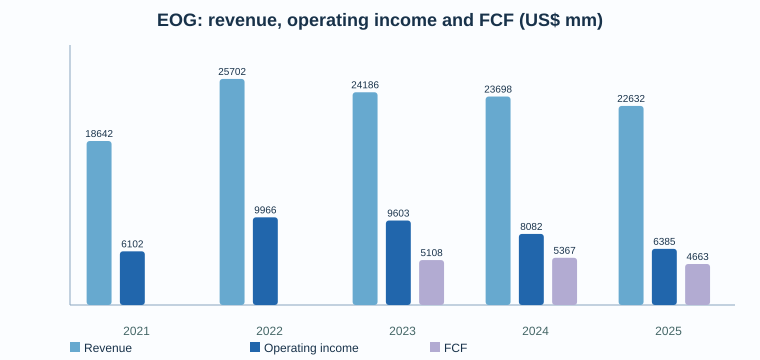
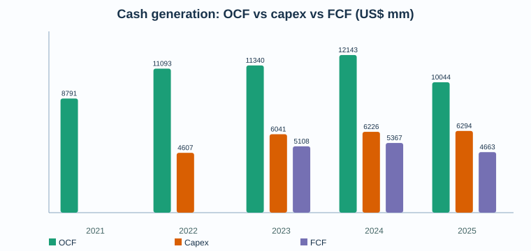
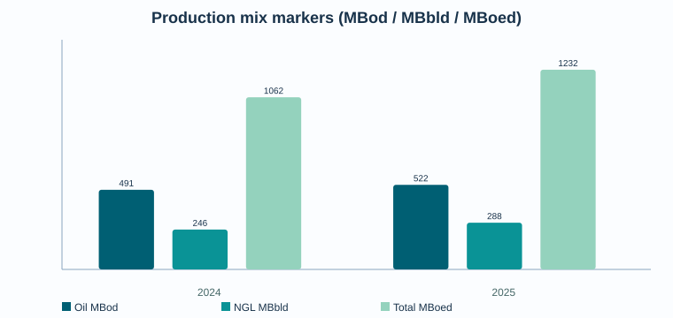

# EOG Resources (EOG) — Deep Dive pre-valoración

**Fecha:** 18 mayo 2026  
**Compañía:** EOG Resources, Inc. — NYSE:EOG  
**Tipo:** Deep Dive pre-valoración / research pack  
**Conclusión corta:** EOG es uno de los E&P estadounidenses de mayor calidad operativa: balance aún sólido, multi-basin shale, cultura de retornos y bajo coste unitario. La pregunta de inversión no es “si es buena compañía”, sino cuánto del retorno estructural ya está en precio y qué FCF normalizado sobrevive bajo petróleo/gas menos favorables tras el aumento de deuda por Encino.

## 1. Resumen del negocio

EOG Resources es una compañía independiente de exploración y producción de petróleo y gas natural. Su base principal está en EE. UU., con reservas probadas también en Trinidad y expansión exploratoria/internacional en Bahrain/UAE. Su modelo económico depende de: producción de crudo, NGLs y gas; diferenciales de realización frente a WTI/Henry Hub; coste de perforación/completions; declino natural de shale; y disciplina de reinversión.

El negocio se entiende mejor como una fábrica de inventario shale premium: reinvierte capex en pozos de alto retorno, busca reducir coste por pozo con tecnología/integración vertical, y devuelve el FCF sobrante vía dividendo ordinario y recompras.

## 2. Resumen ejecutivo

- **Calidad del negocio:** alta dentro de E&P; sigue siendo cíclico y commodity-linked.
- **Eje de tesis:** calidad de inventario + disciplina de capital + realizaciones premium vs sensibilidad a WTI/gas y riesgo de reinversión shale.
- **Situación reciente:** FY 2025 generó $4.7bn de FCF y devolvió el 100% a accionistas; Q1 2026 generó $1.5bn FCF.
- **Balance:** deuda subió de $4.75bn en FY 2024 a $7.94bn en FY 2025; net debt pasó de caja neta de $2.34bn a deuda neta de $4.54bn. Sigue razonable, pero ya no es el balance net-cash de 2024.
- **2026 guidance:** capex $6.3-6.7bn; producción total ~1.396 MBoed midpoint; FCF objetivo indicado por management de ~$4.5bn a strip en febrero 2026; en Q1 subieron guidance de oil/NGL manteniendo capex.

## 3. Modelo de negocio y motores económicos

EOG monetiza moléculas: crudo, NGLs y gas. El valor accionarial viene de cuatro palancas:

1. **Precio realizado:** WTI, Henry Hub, NGL % de WTI y diferenciales locales.
2. **Coste unitario:** LOE, gathering/processing/transport, G&A y DD&A por Boe.
3. **Productividad de pozo:** EUR, lateral length, spacing, completions y declino.
4. **Capital allocation:** ritmo de capex vs mantenimiento, dividendos, recompras y deuda.

La compañía insiste en su ventaja de marketing, tecnología interna e integración vertical. Esto importa porque en shale una diferencia pequeña de coste/realización puede cambiar mucho el FCF en ciclo bajo.

## 4. Segmentos / activos: lectura operativa

EOG no reporta segmentos económicos tradicionales como una industrial; la lectura correcta es por cuencas/activos y mix de commodities.

- **Delaware Basin:** ancla de actividad 2026; 393 net wells completados en 2025 y ~300 esperados en 2026.
- **Eagle Ford / South Texas:** activo maduro, relevante para crudo y cash generation; ~565k net acres y ~115 net wells esperados en Eagle Ford en 2026.
- **Utica:** prioridad creciente tras Encino; posición combinada ~1.1m net acres, con ~85 net wells esperados en 2026.
- **Dorado:** gas play con mayor actividad esperada; ~160k net acres y ~40 net wells esperados en 2026.
- **Trinidad / internacional:** menor peso en volúmenes, pero relevante por opcionalidad exploratoria y diversificación.
- **Encino:** adquisición transformacional 2025 por $5.6bn inclusive of net debt; añade ~675k net core acres, >2bn Boe de recurso no desarrollado indicado por la compañía y convierte Utica en tercer play fundacional junto a Delaware y Eagle Ford.

## 5. Financial forensics

**Lectura:**
- Los ingresos normalizaron desde el pico 2022, pero OCF se mantuvo muy fuerte en 2023-2025.
- FCF 2024 fue superior a 2025 pese a producción menor, por mejor combinación de working capital/capex/precios y balance inicial.
- 2025 incorpora crecimiento vía Encino y mayor deuda. La métrica clave pasa a ser FCF después de capex de mantenimiento y coste de capital completo.
- Q1 2026 fue fuerte: $6.9bn revenue, $2.0bn net income, $3.0bn OCF, $1.6bn capex y $1.5bn FCF.

## 6. Guidance, earnings y outlook

Management comunicó para FY 2026:

- Capex midpoint: **$6.5bn**.
- Producción total midpoint tras Q1: **~1.396 MBoed**.
- Oil midpoint: **548.5 MBod**; NGL midpoint **341 MBbld**; gas midpoint **3,040 MMcfd**.
- Cash operating cost midpoint: **$10.55/Boe**.
- DD&A midpoint: **$9.85/Boe**.
- FCF target indicado en febrero 2026: **~$4.5bn** a strip.

Q1 2026 mostró ejecución mejor que guidance en volúmenes y costes, y la compañía reorientó capital hacia líquidos manteniendo capex total.

## 7. Financials históricos: perspectiva 5 años

| Año | Revenue | Operating income | Net income | OCF | Capex | FCF | Cash | Debt | Net debt |
|---:|---:|---:|---:|---:|---:|---:|---:|---:|---:|
| 2021 | 18,642 | 6,102 | 4,664 | 8,791 | 3,638 | 5,153 | 5,209 | 5,109 | -100 |
| 2022 | 25,702 | 9,966 | 7,759 | 11,093 | 4,619 | 6,474 | 5,972 | 5,078 | -894 |
| 2023 | 24,186 | 9,603 | 7,594 | 11,340 | 5,385 | 5,955 | 5,278 | 3,799 | -1,479 |
| 2024 | 23,698 | 8,082 | 6,403 | 12,143 | 5,353 | 6,790 | 7,092 | 4,752 | -2,340 |
| 2025 | 22,632 | 6,385 | 4,980 | 10,044 | 6,115 | 3,929 | 3,396 | 7,936 | 4,540 |

Notas: importes en US$ mm. Revenue/operating income/net income/OCF/cash/debt 2021-2025 se extraen de SEC companyfacts/EOG filings. Capex 2021-2025 procede de SEC companyfacts / cash-flow oil & gas + equipment capex del source pack; FCF se calcula como OCF menos capex para consistencia histórica. La compañía también presenta una definición non-GAAP de “Capital Expenditures” y FCF que excluye adquisiciones/ARO/non-cash; reconciliar antes de valoración final.

## 8. Producción y mix

- FY 2025: oil 521.9 MBod, NGL 288.2 MBbld, gas 2,533 MMcfd, total 1,232.2 MBoed.
- FY 2024: oil 491.4 MBod, NGL 245.9 MBbld, gas 1,948 MMcfd, total 1,062.1 MBoed.
- Q1 2026: oil 548.5 MBod, NGL 332.1 MBbld, gas 3,020 MMcfd, total 1,383.8 MBoed.

El crecimiento reciente no debe leerse solo como mejora orgánica: Encino impacta la base 2025/2026.

## 9. Sector, competencia y posición relativa

Peer set útil: **FANG/Diamondback**, **COP/ConocoPhillips**, **DVN/Devon**, **PXD histórico dentro de XOM**, **OXY** y **MRO/HES históricos según comparabilidad**. Para valoración, el peer set debe dividirse por:

- shale oil pure-play vs integrado/diversificado;
- leverage/net cash;
- inventory depth y breakeven;
- shareholder return framework;
- exposición gas/NGL vs oil.

EOG suele merecer prima cualitativa por execution, balance y returns, pero esa prima debe testarse contra FCF yield normalizado, no contra FCF de ciclo alto.

## 10. Noticias y narrativa reciente

- **Encino acquisition:** evento material por escala y balance; exige seguimiento de integración, well costs y retorno incremental.
- **Bahrain/UAE/internacional:** opcionalidad, no base case de valoración hasta que haya evidencia de recursos/comercialidad.
- **2026 reallocation hacia líquidos:** positivo para realizaciones si se ejecuta sin deteriorar returns.
- **Recompras:** 21.7m shares en FY 2025 por $2.5bn; 3.2m shares en Q1 2026 por $402m.

## 11. Fortalezas, riesgos y variables de modelización

**Fortalezas**
- Inventario multi-basin y cultura de retornos.
- Coste cash operativo alrededor de $10/Boe.
- FCF recurrente incluso con capex elevado.
- Dividendo ordinario visible + recompras flexibles.

**Riesgos**
- Commodity risk: WTI, HH, NGL % de WTI.
- Declino shale: necesidad permanente de capex para sostener volúmenes.
- Integración Encino y riesgo de pagar crecimiento con balance.
- Cost inflation: servicios, labor, steel, completion intensity.
- Riesgo regulatorio/ambiental y methane/emissions.
- Diferenciales regionales y capacidad midstream.

**Variables críticas para modelo**
- WTI base/bear/bull.
- Henry Hub y diferencial gas US.
- Oil/NGL/gas mix.
- Capex de mantenimiento vs crecimiento.
- Cash cost/Boe y DD&A/Boe.
- Share count after buybacks.
- Net debt target y payout policy.

## 12. Conclusión pre-valoración

EOG parece un compounder cíclico de alta calidad dentro de un sector estructuralmente difícil. La tesis positiva exige demostrar que: (i) el inventario premium permite mantener producción/FCF con capex disciplinado, (ii) Encino añade retorno y no solo volumen, y (iii) el balance sigue permitiendo recompras anticíclicas.

La tesis negativa no necesita asumir mala ejecución: basta con WTI/gas más bajos, menor NGL realization, inflación de costes o capex de mantenimiento superior para comprimir FCF y múltiplo.

## 13. Peer / valuation framework

Métricas recomendadas:

- FCF yield normalizado a WTI $60/$70/$80.
- EV/EBITDA mid-cycle vs peers shale.
- FCF/share tras recompras.
- Net debt/EBITDA bajo precios stress.
- Reinvestment rate: capex / CFO.
- Reserve replacement cost y inventory runway.

No recomiendo valorar EOG solo con P/E: earnings en E&P mezcla precio commodity, DD&A e impairments. El ancla debe ser FCF normalizado y balance-adjusted.

## 14. Scenario matrix pre-modelo

| Escenario | Supuestos | Implicación |
|---|---|---|
| Bear | WTI <$60, HH débil, NGL % bajo, capex no baja proporcionalmente | FCF cae fuerte; recompras se reducen; prima de calidad se comprime |
| Base | WTI $65-75, gas normaliza, capex ~$6.5bn, costes controlados | FCF ~$4-5bn plausible; retorno accionista sostenido |
| Bull | WTI >$80, gas mejora, Encino integra mejor de lo esperado | FCF >$5bn, buybacks aceleran EPS/FCF per share |

## 15. Checklist para pasar a valoración

- Reconciliar 10-K/10-Q completos: capex cash-flow vs “Capital Expenditures” non-GAAP de EOG.
- Normalizar production mix post-Encino.
- Construir sensitivity WTI/HH/NGL realization.
- Separar maintenance capex de growth capex.
- Modelar share count por recompra y dividend cash cost.
- Estimar downside net debt/EBITDA con precios stress.
- Comparar FCF yield con FANG/DVN/COP/OXY bajo mismo deck de precios.

## 16. Bibliografía y fuentes

**Fuentes primarias**
- EOG Resources, Q1 2026 Results, 5 mayo 2026: https://investors.eogresources.com/2026-05-05-EOG-Resources-Reports-First-Quarter-2026-Results
- EOG Resources, FY 2025 / 2026 Capital Plan, 24 febrero 2026: https://investors.eogresources.com/2026-02-24-EOG-Resources-Reports-Fourth-Quarter-and-Full-Year-2025-Results-Announces-2026-Capital-Plan
- EOG Resources, FY 2024 / 2025 Capital Plan, 27 febrero 2025: https://investors.eogresources.com/2025-02-27-EOG-Resources-Reports-Fourth-Quarter-and-Full-Year-2024-Results-Announces-2025-Capital-Plan
- SEC companyfacts CIK 0000821189: https://data.sec.gov/api/xbrl/companyfacts/CIK0000821189.json
- SEC submissions CIK 0000821189: https://data.sec.gov/submissions/CIK0000821189.json

**Limitaciones**
- Este pack es pre-valoración, no recomendación de inversión.
- Algunos datos de capex/FCF históricos se citan desde releases non-GAAP, no desde tabla XBRL homogénea.
- No incluye aún transcript completo de earnings call ni peer model cuantitativo completo.
