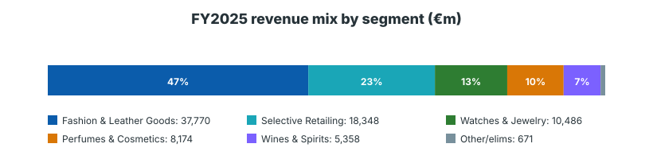
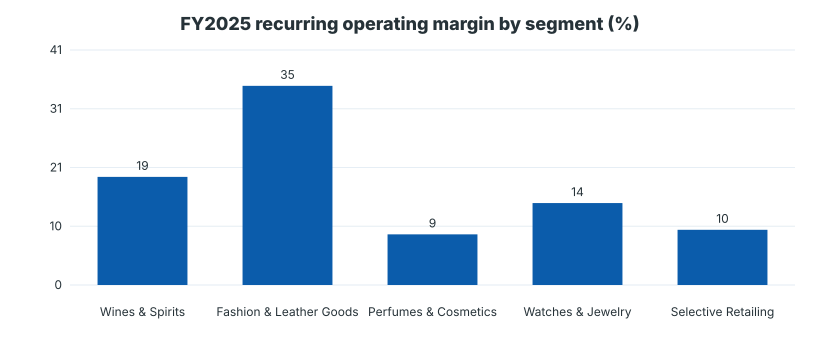
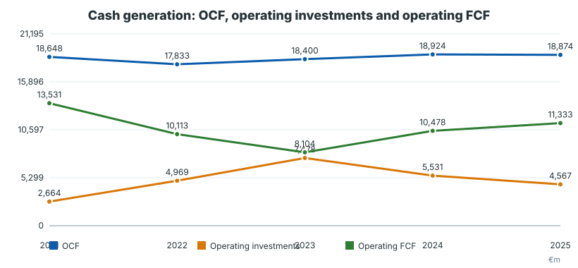
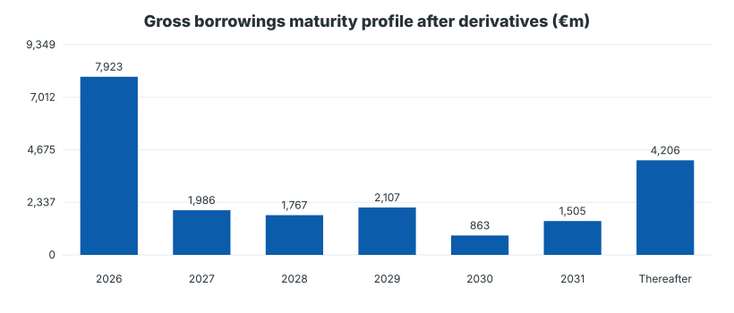
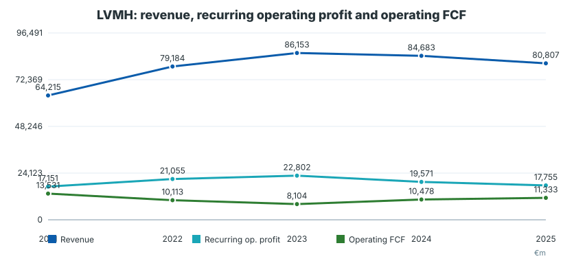
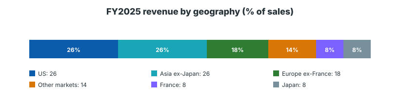

# LVMH Moët Hennessy Louis Vuitton SE — Deep Dive pre-valoración

**Fecha:** 2026-05-22  
**Ticker:** MC.PA / EPA: MC; ADR: LVMUY  
**Moneda:** euros, millones salvo indicación contraria  
**Tipo:** Deep Dive equity pre-valoración  
**Conclusión operativa:** pack de research para alimentar valoración; no es recomendación de inversión.

## Índice
1. Resumen del negocio  
2. Resumen ejecutivo  
3. Modelo de negocio y motores económicos  
4. Segmentos: lectura operativa  
5. Financial forensics  
6. Guidance, trading update y outlook  
7. Financials históricos: perspectiva 5 años  
8. Sector, competencia y posición relativa  
9. Noticias y narrativa reciente  
10. Fortalezas, riesgos y variables de modelización  
11. Conclusión pre-valoración  
12. Peer / sector framework para valoración  
13. Historical snapshot para alimentar el modelo  
14. Scenario matrix pre-modelo  
15. Capex / D&A / FCF bridge conceptual  
16. Checklist final para pasar a valoración  
17. Bibliografía y metodología

---

## 1. Resumen del negocio

LVMH es el mayor grupo global de lujo, con unas 75 Maisons repartidas entre moda y marroquinería, vinos y espirituosos, perfumes y cosmética, relojes y joyería, selective retailing y otras actividades. A cierre de 2025 operaba 6.283 tiendas y generó **€80.807bn de ingresos**, **€17.755bn de beneficio operativo recurrente** y **€10.878bn de beneficio neto atribuible al grupo**.

El motor económico central es la combinación de **deseabilidad de marca, escasez, artesanía, control de distribución y pricing power**. La calidad del grupo no está distribuida de forma homogénea: Fashion & Leather Goods representa el 46.7% de ventas de 2025 pero aproximadamente el 74% del beneficio operativo recurrente antes de otros/eliminaciones. Por tanto, cualquier valoración de LVMH es, en la práctica, una valoración de Louis Vuitton/Dior más una cartera de activos de lujo y retail de distinta calidad.

## 2. Resumen ejecutivo

**Pregunta central de inversión:** ¿está LVMH ante una normalización cíclica digerible dentro de un compounder de lujo de calidad excepcional, o ante un reset más estructural de crecimiento/márgenes tras el boom 2021-2023?

**Lectura inicial:**
- La franquicia sigue siendo de altísima calidad: marcas icónicas, distribución controlada, balance conservador, FCF positivo incluso en desaceleración y capacidad de reinversión.
- El momentum operativo está claramente más débil: ingresos -5% reported y -1% orgánico en FY2025; margen operativo recurrente baja de 26.5% en 2023 a 22.0% en 2025.
- Q1 2026 muestra estabilización tenue: ventas -6% reported por FX, pero +1% orgánico; Fashion & Leather Goods aún -2% orgánico.
- El balance no es el problema: net financial debt de €6.857bn, 0.39x beneficio operativo recurrente, €13.5bn de caja + activos financieros corrientes y €10.8bn de líneas confirmadas no dispuestas.
- El riesgo de valoración está en normalizar demasiado rápido márgenes y crecimiento de Fashion & Leather Goods.

**Qué debe probar el modelo:** crecimiento orgánico sostenible por segmento, recuperación de margen en F&LG, normalización de capex/ventas, calidad del FCF lease-adjusted y sensibilidad a FX/China/US.

## 3. Modelo de negocio y motores económicos

LVMH gana dinero monetizando activos intangibles de largo plazo —marcas, herencia, creatividad, artesanía y distribución— a través de productos de alto margen. Sus palancas principales son:

- **Precio/mix:** capacidad de subir precios y vender más producto high-end sin destruir deseabilidad.
- **Volumen selectivo:** expansión controlada de tiendas y categorías; no maximizar unidades si diluye marca.
- **DTC y retail propio:** en Fashion & Leather Goods, el 95% de ventas 2025 fue retail, lo que permite controlar experiencia, inventario, precio y datos de cliente.
- **Reinversión en marca:** capex de retail, flagship stores, talleres, marketing, eventos y creatividad.
- **Diversificación interna:** Sephora aporta crecimiento y escala; Tiffany/Bvlgari exponen a hard luxury; Wines & Spirits añade activos patrimoniales pero con más ciclo de inventario.

La contrapartida es que el grupo necesita invertir continuamente en marca, tiendas y producto. El lujo de escala no es asset-light puro: la calidad se defiende con capex, inventario, talento creativo y control de distribución.

## 4. Segmentos: lectura operativa

| Segmento | Ventas 2025 | Orgánico 2025 | ROP 2025 | Margen 2025 | Lectura |
|---|---:|---:|---:|---:|---|
| Wines & Spirits | 5,358 | -5% | 1,016 | 19.0% | Cíclico e inventory-heavy; cognac/US/China siguen presionados. |
| Fashion & Leather Goods | 37,770 | -5% | 13,209 | 35.0% | Núcleo de valor; margen cae desde 37.1% en 2024 y 39.9% en 2023. |
| Perfumes & Cosmetics | 8,174 | 0% | 727 | 8.9% | Más defensivo, menor margen; innovación y selectividad importan. |
| Watches & Jewelry | 10,486 | +3% | 1,514 | 14.4% | Tiffany/Bvlgari y hard luxury; mejora relativa en Q1 2026. |
| Selective Retailing | 18,348 | +4% | 1,780 | 9.7% | Sephora compensa DFS; menor margen pero buen crecimiento. |

**Clave:** el segmento que más pesa en valor —Fashion & Leather Goods— es precisamente el que más presión muestra en FY2025/Q1 2026. Sephora y Jewelry ayudan, pero no compensan completamente un reset de margen en Vuitton/Dior si este fuera estructural.

## 5. Financial forensics

### Cash bridge y calidad de FCF

LVMH define operating free cash flow como cash flow operativo menos inversiones operativas y repayment de lease liabilities. Es una métrica más estricta que OCF - capex simple y más útil para no sobreestimar caja en un grupo con red de tiendas relevante.

En 2025, el beneficio operativo cae, pero el FCF mejora: operating FCF sube a **€11.333bn** desde €10.478bn en 2024. La explicación es mejor working capital y menor capex. La necesidad de working capital fue **€576m** frente a €1.925bn en 2024, aunque inventarios siguieron absorbiendo €1.315bn.

### Balance, deuda y liquidez

| Concepto | 2025 | 2024 | Lectura |
|---|---:|---:|---|
| Gross borrowings after derivatives | 20,358 | 22,815 | Deuda bruta relevante, pero bien cubierta. |
| Caja + current AFS financial assets | 13,502 | 13,587 | Liquidez inmediata alta. |
| Net financial debt | 6,857 | 9,228 | Apalancamiento bajo. |
| Equity | 68,949 | 69,287 | Balance sólido. |
| Net financial debt / equity | 9.9% | 13.3% | Conservador. |
| Undrawn confirmed credit lines | 10,800 | n/a | Buena protección de liquidez. |

Hay una concentración de vencimientos en 2026 (€7.923bn), pero es manejable frente a caja/AFS, líneas no dispuestas y generación de caja. En 2025 LVMH repagó bonos por €2.5bn y emitió €2.0bn bajo EMTN: €1.1bn marzo 2029 al 2.625% y €0.9bn marzo 2032 al 3.00%.

## 6. Guidance, trading update y outlook

LVMH no da guidance anual numérico preciso en las fuentes revisadas. La guía cualitativa se centra en deseabilidad, retail excellence, innovación, disciplina de inversión y eficiencia en categorías difíciles.

**Q1 2026:** ingresos de **€19.121bn**, -6% reported y +1% orgánico. El FX fue -7%. Por segmento:

| Segmento | Q1 2026 ventas | Reported | Orgánico |
|---|---:|---:|---:|
| Wines & Spirits | 1,273 | -2% | +5% |
| Fashion & Leather Goods | 9,247 | -9% | -2% |
| Perfumes & Cosmetics | 2,038 | -6% | 0% |
| Watches & Jewelry | 2,443 | -2% | +7% |
| Selective Retailing | 4,048 | -3% | +4% |
| Total LVMH | 19,121 | -6% | +1% |

Management habla de China/Asia/US más sólidos, demanda local resiliente en Europa, disrupción en Middle East y fuerte presión de divisa. El mensaje operativo es prudente: ganar cuota, proteger iconos, agilidad/eficiencia e inversiones selectivas.

## 7. Financials históricos: perspectiva 5 años

| Año fiscal | Revenue | ROP | Op. profit | Net profit group share | OCF | Op. investments | Operating FCF | Net fin. debt | ROP margin | FCF / net income |
|---:|---:|---:|---:|---:|---:|---:|---:|---:|---:|---:|
| 2021 | 64,215 | 17,151 | 17,155 | 12,036 | 18,648 | (2,664) | 13,531 | 9,607 | 26.7% | 112.4% |
| 2022 | 79,184 | 21,055 | 21,001 | 14,084 | 17,833 | (4,969) | 10,113 | 9,201 | 26.6% | 71.8% |
| 2023 | 86,153 | 22,802 | 22,560 | 15,174 | 18,400 | (7,478) | 8,104 | 10,746 | 26.5% | 53.4% |
| 2024 | 84,683 | 19,571 | 18,907 | 12,550 | 18,924 | (5,531) | 10,478 | 9,228 | 23.1% | 83.5% |
| 2025 | 80,807 | 17,755 | 17,099 | 10,878 | 18,874 | (4,567) | 11,333 | 6,857 | 22.0% | 104.2% |

Interpretación:
- 2021-2023 fue un régimen extraordinario de recuperación/post-Covid y pricing/mix fuerte.
- 2024-2025 marca desaceleración: ventas y margen retroceden, pero el negocio mantiene caja.
- El capex 2023 fue excepcionalmente alto; 2025 normaliza a 5.7% de ventas.
- El balance mejora en 2025 pese a dividendos/buybacks, porque la conversión de caja se recupera.

## 8. Sector, competencia y posición relativa

Peers relevantes:
- **Hermès:** benchmark de ultra-lujo, escasez y margen. No es perfectamente comparable porque es más concentrado y con modelo de scarcity superior.
- **Kering:** grupo de lujo con concentración y turnaround, útil como referencia bear-case de brand fatigue/margin reset.
- **Richemont:** hard luxury, jewelry/watches; comparable para Tiffany/Bvlgari y exposición Asia.
- **Moncler:** soft luxury DTC de menor escala, útil para crecimiento/margen en una marca enfocada.
- **Bain-Altagamma / sector luxury:** contexto de ciclo aspiracional vs HNWI, China/US, turismo y price/mix.

LVMH se sitúa entre Hermès —calidad extrema, menor diversificación— y Kering —mayor riesgo de turnaround—. Su ventaja es escala, cartera y distribución; su desventaja para valoración es que la media del grupo incluye negocios de menor margen y más cíclicos que Vuitton/Dior.

## 9. Noticias y narrativa reciente

- FY2025 confirma presión sectorial: descenso orgánico leve, pero compresión de margen significativa.
- Q1 2026 sugiere estabilización orgánica, con Watches & Jewelry y Sephora mejor que Fashion & Leather Goods.
- DFS sigue en optimización; en enero de 2026 se firmó acuerdo con China Tourism Group Duty Free para adquirir operaciones de DFS Greater China, especialmente Hong Kong y Macao Gallerias.
- Riesgos recientes señalados por management: FX, geopolítica/Middle East, aranceles US y medidas antidumping en China para Wines & Spirits.

## 10. Fortalezas, riesgos y variables de modelización

**Fortalezas:**
- Marcas irreplicables y escala global.
- Distribución controlada y pricing power.
- Balance conservador.
- Diversificación por categorías/geografías.
- FCF resiliente incluso con presión en ingresos/margen.

**Riesgos:**
- Concentración económica en Fashion & Leather Goods.
- Ciclo de lujo aspiracional y China/Asia.
- FX adverso: -7% en Q1 2026.
- Inventario/working capital, especialmente Wines & Spirits y moda.
- Creative transitions en Dior, Celine, Loewe, Givenchy, Fendi.
- Valuation derating si el mercado baja el crecimiento terminal o normaliza márgenes a la baja.

**Variables clave para el modelo:** organic growth por segmento, margen F&LG, capex/revenue, working capital normalizado, FX bridge, tax rate normalizado, operating FCF lease-adjusted y política de capital returns.

## 11. Conclusión pre-valoración

LVMH sigue siendo un activo de calidad estructural alta, pero el Deep Dive no debe asumir automáticamente que 2021-2023 es el run-rate. La valoración debe partir de 2025 como año de normalización parcial y probar tres cuestiones:

1. ¿F&LG vuelve a crecimiento orgánico positivo y margen 36-38%, o se queda en mid-30s?
2. ¿La recuperación China/US es real y broad-based, o solo estabilización tras debilidad?
3. ¿El FCF 2025 es sostenible con capex normalizado, o se benefició de recorte temporal de inversión/working capital?

## 12. Peer / sector framework para valoración

Métricas recomendadas para comparar: EV/EBIT, EV/EBITDA, P/E, FCF yield, revenue CAGR, EBIT margin, ROIC, net debt/EBITDA y exposición geográfica. La comparabilidad debe ajustarse: Hermès merece prima por scarcity; Kering puede representar downside de ejecución; Richemont ayuda en jewelry; Moncler en DTC soft luxury.

## 13. Historical snapshot para alimentar el modelo

- Base revenue FY2025: **€80.807bn**.
- ROP FY2025: **€17.755bn**, margen **22.0%**.
- Operating FCF FY2025: **€11.333bn**.
- Capex / revenue FY2025: **5.7%**; rango 2021-2025: 4.1%-8.7%.
- Net financial debt FY2025: **€6.857bn**.
- Dividend per share: **€13.00** para 2023-2025, propuesto para FY2025.
- Tax rate FY2025: fuente señala que debe normalizarse por tasa efectiva elevada; usar cautela.

## 14. Scenario matrix pre-modelo

| Escenario | Supuesto operativo | Margen | FCF | Qué lo validaría |
|---|---|---|---|---|
| Bear | Lujo aspiracional débil, China irregular, F&LG estancado | Grupo 20-21%, F&LG mid-30 o menos | FCF presionado por inventario/capex | Q2-Q4 2026 orgánico plano/negativo, inventarios altos, rebajas de peers |
| Base | Recuperación gradual, Sephora/Jewelry compensan, F&LG vuelve a low-single-digit | Grupo 22-24% | FCF ~€10-12bn sostenible | Orgánico positivo, capex 5-6%, working capital normal |
| Bull | Reaceleración China/US, Vuitton/Dior recuperan pricing/mix | Grupo 24-26%, F&LG high-30s | FCF >€12bn con crecimiento | F&LG mid-single-digit orgánico, margen recupera, FX menos adverso |

## 15. Capex / D&A / FCF bridge conceptual

Para valorar LVMH conviene separar:
- **Maintenance capex**: tiendas, talleres, experiencia retail y sistemas necesarios para sostener marca.
- **Growth capex**: aperturas/renovaciones selectivas, Tiffany/Sephora, capacidad productiva y hospitalidad.
- **Lease-adjusted FCF**: usar operating FCF de LVMH como métrica conservadora, porque incluye lease repayments.

No usar únicamente OCF - capex sin explicar leases; tendería a mejorar artificialmente la caja disponible para equity.

## 16. Checklist final para pasar a valoración

- [ ] Separar crecimiento orgánico, FX y estructura.
- [ ] Modelar Fashion & Leather Goods de forma explícita.
- [ ] Normalizar margen por segmento, no solo margen grupo.
- [ ] Usar operating FCF lease-adjusted o reconciliarlo con unlevered FCF.
- [ ] Estresar China/Asia ex-Japan y US.
- [ ] Tratar Wines & Spirits como ciclo separado.
- [ ] Comparar prima/descuento frente a Hermès, Kering, Richemont y Moncler.
- [ ] Confirmar market cap/EV/múltiplos con datos de mercado actualizados antes de concluir valoración.

## 17. Bibliografía y metodología

**Fuentes primarias usadas:**
1. LVMH, *2025 Universal Registration Document including CSRD reporting*, publicado 2026-04-01.  
2. LVMH, *2025 Full Year Results*, página IR, 2026-01-27.  
3. LVMH, *Financial Documents — December 31, 2025*. Usado para estados financieros, segmentos, cash flow, deuda, liquidez, working capital y vencimientos.  
4. LVMH, *2025 Full Year Results presentation*. Usado para contexto de resultados.  
5. LVMH, *2026 Q1 Revenue*, página IR, 2026-04-13.  
6. LVMH, *Q1 2026 Revenue presentation*. Usado para trading update, segmentos y geografías Q1 2026.  
7. LVMH, *Financial Documents — December 31, 2022*. Usado para datos históricos 2021-2022.

**Notas metodológicas:** todas las cifras son reportadas por LVMH salvo ratios derivados. El pack no incluye múltiplos de mercado live ni consenso, porque deben verificarse en terminal/datos de mercado antes de usarse para decisión. Peer framework es cualitativo en esta versión. La siguiente iteración debería añadir tabla de múltiplos actualizada y extraer risk factors completos del URD.
