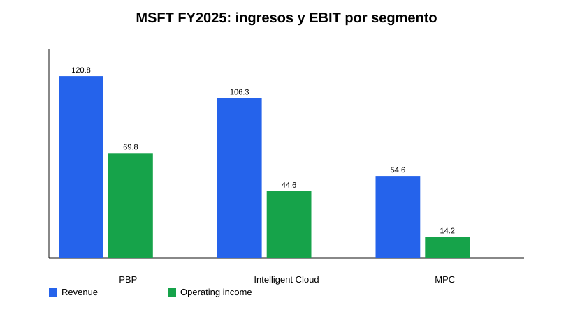
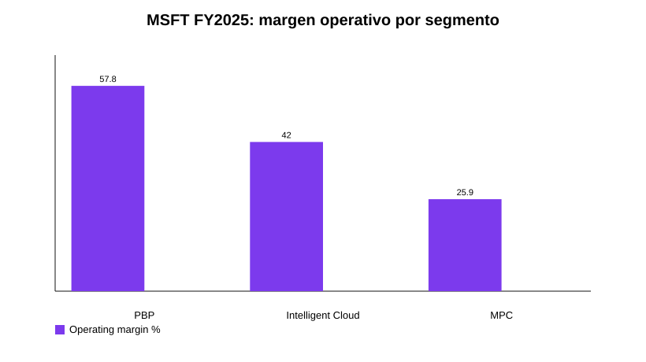
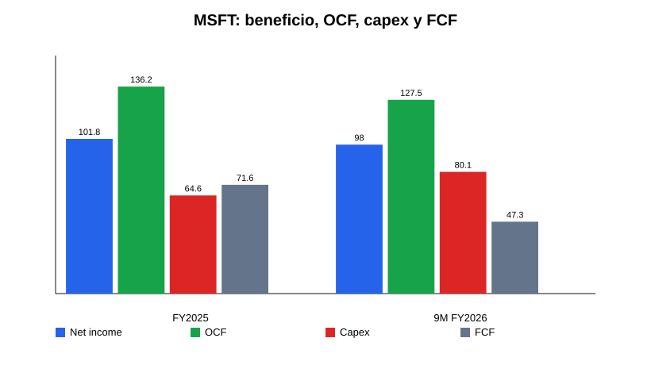
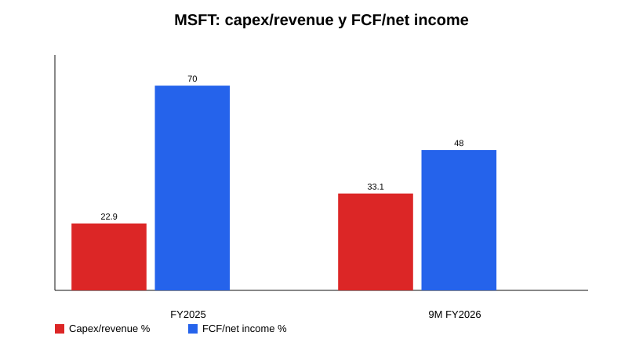
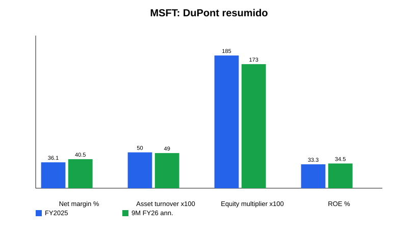
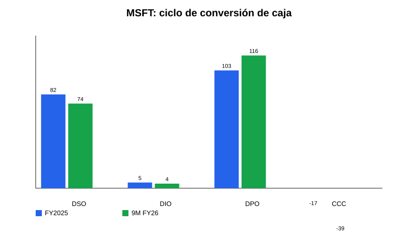

# Microsoft Corporation (MSFT) — Research Deep Dive v1

**Tipo de documento:** Research pre-valoración  
**Estado:** v1 metodológico, no tesis final ni recomendación  
**Fecha de corte:** 13-may-2026  
**Objetivo:** condensar filings, earnings, call, guidance, financials y noticias/material reciente en una pieza previa al modelo de valoración.

---

## Índice

- [1. Resumen ejecutivo](#1-resumen-ejecutivo)
- [2. Modelo de negocio y motores económicos](#2-modelo-de-negocio-y-motores-econmicos)
- [3. Segmentos: lectura operativa](#3-segmentos-lectura-operativa)
- [4. Financial forensics](#4-financial-forensics)
- [5. Guidance, earnings call y outlook](#5-guidance-earnings-call-y-outlook)
- [6. Sector, competencia y posición relativa](#6-sector-competencia-y-posicin-relativa)
- [7. Noticias y narrativa reciente](#7-noticias-y-narrativa-reciente)
- [8. Fortalezas, riesgos y variables de modelización](#8-fortalezas-riesgos-y-variables-de-modelizacin)
- [9. Conclusión pre-valoración](#9-conclusin-pre-valoracin)
- [10. Peer / sector framework for valuation](#10-peer--sector-framework-for-valuation)
- [11. Historical financial snapshot para alimentar el modelo](#11-historical-financial-snapshot-para-alimentar-el-modelo)
- [12. Scenario matrix pre-modelo](#12-scenario-matrix-pre-modelo)
- [13. D&A / capex bridge conceptual](#13-da--capex-bridge-conceptual)
- [14. Checklist final para pasar a valoración](#14-checklist-final-para-pasar-a-valoracin)
- [15. Methodology notes / limitations / next iteration](#15-methodology-notes--limitations--next-iteration)

---

## 1. Resumen ejecutivo

Microsoft sigue siendo una de las compañías de mayor calidad económica dentro del software global: escala extraordinaria, distribución enterprise única, ingresos recurrentes, márgenes elevados, balance net cash y una conversión de beneficio a caja operativa muy superior a la media. La lectura central del research no es si el negocio actual es bueno —lo es—, sino si el nuevo ciclo de inversión en AI/cloud mantiene o degrada la calidad del free cash flow estructural.

En FY2025 Microsoft generó **$281.7bn de ingresos**, **$128.5bn de operating income** y **$101.8bn de net income**. En Q3 FY2026 volvió a acelerar: ingresos **$82.9bn**, +18% YoY; operating income **$38.4bn**, +20%; EPS diluido **$4.27**, +23%. El crecimiento está concentrado en Microsoft Cloud, Azure, M365 Commercial, Dynamics, LinkedIn y monetización AI/Copilot. Azure creció **+40% YoY** en Q3 FY2026 y Microsoft comunicó una AI business ARR superior a **$37bn**, +123% YoY.

El punto crítico es la intensidad de capital. En FY2025 el capex fue **$64.6bn**; en los primeros nueve meses de FY2026 ya alcanzó **$80.1bn**, con capex/revenue aproximado de **33.1%** frente a **22.9%** en FY2025. Management guía **>$40bn de capex en Q4 FY2026** y aproximadamente **$190bn para calendar 2026**, incluyendo presión por componentes. Esto comprime el FCF: la conversión FCF/net income cae de ~70% en FY2025 a ~48% en 9M FY2026.

La tesis previa al modelo debe, por tanto, girar alrededor de una pregunta: **¿la inversión actual en AI/cloud produce retornos incrementales suficientes para preservar un perfil de compounder de alta calidad, o Microsoft entra en una fase estructuralmente más capital-intensive con menor FCF yield normalizado?**

---

## 2. Modelo de negocio y motores económicos

Microsoft opera tres segmentos: **Productivity and Business Processes (PBP)**, **Intelligent Cloud** y **More Personal Computing (MPC)**. La compañía monetiza mediante suscripciones por usuario, consumo cloud, licencias enterprise/on-prem, publicidad, gaming y hardware. La ventaja estructural reside en la combinación de distribución enterprise, ecosistema integrado y capacidad de empaquetar AI dentro de workflows existentes.

PBP es el motor de margen: Microsoft 365, Office, Teams, Copilot, LinkedIn, Dynamics y Power Platform. En FY2025 generó **$120.8bn** de ingresos y **$69.8bn** de operating income, con margen operativo ~58%. Intelligent Cloud es el motor de crecimiento: Azure, server products, GitHub, Nuance y servicios enterprise. En FY2025 generó **$106.3bn** de ingresos, +21%, y **$44.6bn** de operating income. MPC es menos estratégico para la tesis principal: Windows, Devices, Xbox y Search; aporta caja, pero con menor margen y más ciclicidad.

La capa transversal es AI. Microsoft intenta capturar valor en tres niveles: infraestructura Azure/AI, plataformas de datos/modelos —Foundry, Fabric, GitHub— y aplicaciones finales —M365 Copilot, Dynamics agents, Security Copilot, Copilot Studio—. El modelo económico ideal sería doble: más consumo Azure y mayor ARPU por usuario. El riesgo es que la monetización de AI venga con COGS/inferencia y depreciación más altos que el SaaS tradicional.

---

## 3. Segmentos: lectura operativa

### Productivity and Business Processes

PBP combina el activo de mayor calidad de Microsoft —M365 Commercial— con LinkedIn, Dynamics y Power Platform. En Q3 FY2026 el segmento reportó **$35.0bn** de revenue, +17% YoY; M365 Commercial cloud +19%; M365 Consumer cloud +33%; LinkedIn +12%; Dynamics 365 +22%. Management señaló más de **20M paid M365 Copilot seats**, seat growth +250% YoY, clientes >50k seats cuadruplicados y queries por usuario +~20% QoQ.

La lectura pre-modelo: PBP puede ser el vector de mayor creación de valor si Copilot eleva ARPU y retención sin destruir margen. Pero todavía hay que modelar attach rate, precio neto, uso real, coste de inferencia y elasticidad del cliente enterprise. El riesgo no es falta de distribución; es que el producto AI sea menos rentable por unidad de revenue que el Office/M365 histórico.

### Intelligent Cloud / Azure

Intelligent Cloud es el centro de gravedad de la tesis actual. En Q3 FY2026 generó **$34.7bn**, +30% YoY, con Azure +40%. Management sostiene que la demanda excede la capacidad disponible. Microsoft añadió ~1GW de capacidad en el trimestre y afirma estar en camino de duplicar su footprint total en dos años.

Esta combinación es potente pero exige disciplina analítica. Si Azure está supply-constrained, el crecimiento reportado puede subestimar demanda. Pero si el capex se adelanta demasiado, la depreciación y la utilización futura determinarán el retorno real. El modelo debe incorporar lag entre capex y revenue, duración de activos GPU/CPU, mix AI vs cloud tradicional, gross margin cloud y eventual normalización de utilización.

### More Personal Computing

MPC reportó **$13.2bn** en Q3 FY2026, -1% YoY. Windows OEM/Devices cayó -2%, Xbox content/services -5%, Search ex-TAC creció +12%. Para valoración, MPC debería tratarse como segmento secundario: Search tiene optionality AI, pero Windows/Gaming/Devices no definen el core de calidad. Puede aportar caja y opcionalidad, pero también diluye margen y complejiza la narrativa.

---

## 4. Financial forensics

Microsoft mantiene métricas financieras excepcionales, aunque el FCF está bajo presión por capex. En FY2025 el OCF fue **$136.2bn** y el FCF simple **$71.6bn**. En 9M FY2026 el OCF fue **$127.5bn**, pero el capex de **$80.1bn** redujo el FCF a **$47.3bn**.

El ROE no depende de apalancamiento financiero. En FY2025 el ROE aproximado fue **33.3%**, explicado por net margin **36.1%**, asset turnover **0.50x** y equity multiplier **1.85x**. En 9M FY2026 anualizado el ROE aproximado sube a **34.5%**, con net margin **40.5%** y menor equity multiplier. La calidad del retorno sigue siendo principalmente margen y escala, no leverage.

El working capital sigue siendo favorable. El ciclo de conversión de caja aproximado fue negativo: **-17 días FY2025** y **-39 días 9M FY2026**, con DSO ~82/74 días, DIO irrelevante y DPO ~103/116 días. La unearned revenue cae estacionalmente de $67.3bn a $53.7bn entre jun-2025 y mar-2026, pero el commercial RPO aumenta hasta **$627bn** en Q3 FY2026. Esto da visibilidad, aunque no elimina el riesgo de margen ni timing de conversión.

En balance, Microsoft conserva posición net cash. A mar-2026 tenía **$78.3bn** en cash + short-term investments frente a **$40.3bn** de deuda financiera. La cobertura de intereses supera 50x. La deuda no es restricción estratégica; la restricción real es el retorno del capital incremental invertido en AI/datacenters.

---

## 5. Guidance, earnings call y outlook

La guía de Q4 FY2026 apunta a continuidad de crecimiento elevado: PBP **$37.0–37.3bn**, Intelligent Cloud **$37.95–38.25bn**, MPC **$11.75–12.25bn**. Management espera margen operativo FY2026 +~1 punto YoY pese a inversión AI/cloud y costes puntuales de retiro. El mensaje más importante de la call es que Azure continúa limitado por capacidad y que el capex seguirá aumentando.

El capex guía es la variable dominante: **>$40bn en Q4 FY2026** y aproximadamente **$190bn en calendar 2026**. Management justifica la inversión por demanda observable, RPO, AI ARR, contratos cloud, mejoras de eficiencia y optimización vertical del stack —software, silicon propio, modelos, networking y datacenters—. Para el modelo, esto exige un escenario explícito de retorno sobre capital incremental, no una extrapolación simple de márgenes históricos.

---

## 6. Sector, competencia y posición relativa

Microsoft compite en cloud con AWS, Google Cloud, Oracle y entornos híbridos/private cloud. En productivity compite con Google Workspace, Salesforce, Slack/Atlassian y nuevas herramientas AI-native. En AI platform compite con hyperscalers, OpenAI/ecosistema de modelos, Anthropic/Google/Meta/xAI/Mistral y capas de aplicación vertical.

Su ventaja es distribución: Microsoft ya controla identidad, productividad, colaboración, developer tools, security, data y cloud en muchas empresas. Esto reduce coste de adquisición y facilita bundling. El riesgo regulatorio deriva precisamente de esa ventaja: antitrust, bundling, privacidad, seguridad y soberanía cloud.

La competencia relevante no es solo funcional, sino de capital. AI se está convirtiendo en una carrera de infraestructura. Microsoft puede financiarla; pocos pueden. Pero tener capacidad de invertir no garantiza retornos. El modelo debe comparar growth incremental y margen contra el aumento de PP&E, depreciation y capex maintenance futuro.

---

## 7. Noticias y narrativa reciente

La narrativa reciente se concentra en AI infrastructure, Copilot adoption, OpenAI partnership, seguridad/calidad y capex. Microsoft comunicó el avance de su partnership con OpenAI, expansión de datacenter capacity y colaboración en silicon. La compañía también enfatiza Secure Future Initiative y Quality Excellence Initiative como respuesta a la criticidad de sus servicios. Para valoración, estas noticias no son inputs independientes si no cambian números, pero ayudan a entender prioridades de capital y riesgo de ejecución.

Caveat: esta sección se mantiene deliberadamente compacta en v1. No he intentado agotar todas las noticias overnight; el estándar metodológico correcto es separar noticias que afectan hipótesis del modelo de ruido narrativo.

---

## 8. Fortalezas, riesgos y variables de modelización

La fortaleza principal es la combinación de margen, escala, recurrencia, balance y distribución. Microsoft puede monetizar AI en infraestructura y aplicaciones, y tiene RPO/contratos que aportan visibilidad. PBP ofrece margen extraordinario; Azure ofrece crecimiento; el balance permite absorber ciclos de inversión.

Los riesgos principales son: capex estructuralmente más alto, depreciación futura, gross margin cloud bajo presión, ROI incierto de AI, concentración de demanda en pocos workloads/clientes, dependencia estratégica de OpenAI, competencia hyperscaler, presión regulatoria y posible sobrecapacidad si la demanda AI se normaliza.

Para modelizar, las variables críticas son: crecimiento Azure CC, Microsoft Cloud gross margin, capex/revenue normalizado, D&A/revenue, FCF conversion, RPO/current RPO, AI ARR, Copilot paid seats/attach rate/ARPU, coste de inferencia, opex discipline y shareholder returns vs FCF.

---

## 9. Conclusión pre-valoración

Microsoft llega a la valoración como negocio de calidad excepcional, pero con una pregunta nueva: el compounder asset-light histórico se está transformando parcialmente en un compounder cloud/AI mucho más intensivo en capital. Esto no invalida la tesis; puede incluso reforzar el moat si los retornos son altos y la escala crea barreras. Pero obliga a valorar Microsoft menos como software puro y más como plataforma tecnológica integrada con un ciclo de inversión de infraestructura masivo.

La valoración debería construirse alrededor de tres escenarios: base con normalización gradual de capex y Azure sosteniendo crecimiento alto; bull con Copilot/Azure AI convirtiendo capex en revenue de alto margen; bear con capex persistente, menor utilización, presión de gross margin y FCF yield estructuralmente inferior.

---

## 10. Peer / sector framework for valuation

Para no valorar Microsoft en el vacío, el peer set útil debe separarse por motor económico, no por etiqueta sectorial única:

- **Hyperscale cloud:** AWS/Amazon, Google Cloud/Alphabet, Oracle Cloud y, en menor medida, private/hybrid cloud. Sirve para evaluar Azure growth, cloud gross margin, capex intensity, utilization y retorno incremental de infraestructura AI.
- **Enterprise software / productivity:** Google Workspace, Salesforce, ServiceNow, Adobe, Atlassian y vertical SaaS. Sirve para estimar pricing power, seat expansion, retention, bundle risk y margen de software puro.
- **AI platform / infrastructure:** NVIDIA como proveedor crítico, OpenAI/Anthropic/Google/Meta/Mistral/xAI como capa de modelos, y clouds alternativos. Sirve para entender bargaining power, coste de inferencia, dependencia estratégica y riesgo de commoditización.
- **Consumer/gaming/search:** Alphabet Search, Meta ads, Sony/Nintendo y plataformas gaming. Es secundario para la tesis MSFT, pero relevante para MPC y optionality de AI search.

El comparable más importante para el modelo no es Salesforce ni Adobe; es el diferencial entre **Microsoft Cloud/Azure economics** y **AWS/Google Cloud economics**. Si Azure AI escala con margen parecido al cloud maduro, el capex actual puede reforzar moat y crecimiento. Si escala con margen estructuralmente inferior por GPU depreciation, power, networking e inferencia, el múltiplo debería normalizarse a la baja aunque el revenue crezca.

Framework práctico para peers:

- Comparar cloud revenue growth y operating margin, no solo revenue growth total.
- Separar capex de maintenance vs growth/AI buildout.
- Mirar D&A como lagged cost del capex reciente.
- Comparar RPO/backlog y duration de contratos cloud.
- Evaluar cuánto pricing power real existe en AI apps: Copilot ARPU, attach rate, churn, discounting y usage intensity.

---

## 11. Historical financial snapshot para alimentar el modelo

Tabla base a completar en la hoja de valoración. Esta versión deja ya los anchors principales:

- **FY2025 revenue:** $281.7bn.
- **FY2025 operating income:** $128.5bn.
- **FY2025 net income:** $101.8bn.
- **FY2025 operating cash flow:** $136.2bn.
- **FY2025 capex:** $64.6bn.
- **FY2025 FCF simple:** $71.6bn.
- **FY2025 capex/revenue:** ~22.9%.
- **FY2025 FCF/net income:** ~70%.
- **9M FY2026 revenue:** ~$242bn implícito por capex/revenue calculado.
- **9M FY2026 operating cash flow:** $127.5bn.
- **9M FY2026 capex:** $80.1bn.
- **9M FY2026 FCF simple:** $47.3bn.
- **9M FY2026 capex/revenue:** ~33.1%.
- **9M FY2026 FCF/net income:** ~48%.
- **Q3 FY2026 revenue:** $82.9bn, +18% YoY.
- **Q3 FY2026 operating income:** $38.4bn, +20% YoY.
- **Q3 FY2026 EPS diluted:** $4.27, +23% YoY.
- **Q3 FY2026 Azure growth:** +40% YoY.
- **Q3 FY2026 commercial RPO:** $627bn.
- **Mar-2026 cash + STI:** $78.3bn.
- **Mar-2026 debt:** $40.3bn.

La serie histórica completa de 5 años debería usarse en el modelo, pero para acabar este research pre-valoración la lectura ya es suficiente: Microsoft no tiene problema de demanda, margen actual ni balance. La incertidumbre de valoración está concentrada en **normalización de capex, D&A futura y FCF conversion**.

---

## 12. Scenario matrix pre-modelo

**Base case:** Azure mantiene crecimiento alto pero desacelera gradualmente; Copilot aumenta ARPU en PBP sin deteriorar materialmente margen; capex/revenue baja desde el pico FY2026 hacia una zona más normalizada; D&A sube con lag pero queda absorbida por revenue growth. Resultado: Microsoft conserva perfil compounder, aunque con FCF conversion inferior al software histórico durante varios años.

**Bull case:** la demanda AI supera capacidad durante más tiempo, Copilot/agents consiguen alto attach enterprise, Azure AI escala con fuerte utilización y Microsoft captura valor tanto en infraestructura como aplicación. El capex de 2025-2026 se convierte en moat físico y contractual. Resultado: crecimiento y duración justifican múltiplo premium pese a inversión elevada.

**Bear case:** AI revenue crece, pero con economics peores: alta depreciación, inferencia cara, presión competitiva en cloud, baja monetización neta de Copilot y riesgo de sobrecapacidad. Revenue headline sigue fuerte, pero FCF yield normalizado cae y el mercado empieza a tratar Microsoft más como infraestructura tecnológica capital-intensive que como software puro.

**Variables que deciden el escenario:**

- Azure growth ex-capacity constraint.
- Utilization de nueva capacidad AI/cloud.
- Cloud gross margin y D&A/revenue.
- Copilot attach rate, ARPU neto y uso real.
- FCF conversion después del pico de capex.
- RPO/current RPO y duración de contratos.
- Disciplina en buybacks si FCF está temporalmente comprimido.

---

## 13. D&A / capex bridge conceptual

El error de valoración más probable sería tratar el capex AI como gasto puntual sin coste económico posterior. La secuencia correcta es:

1. Capex actual aumenta PP&E.
2. La capacidad entra en servicio con retraso.
3. D&A sube después, afectando operating income aunque el cash outflow ya ocurrió.
4. Si la utilización es alta y el pricing aguanta, el revenue incremental compensa la depreciación.
5. Si la utilización o pricing decepcionan, el margen cloud y el FCF normalizado se deterioran.

Por tanto, el modelo no debería extrapolar FCF de 9M FY2026 como run-rate permanente, pero tampoco debería ignorarlo. La pregunta correcta es qué parte del capex actual es growth capex con alto retorno y qué parte se convierte en maintenance capex estructural para competir en AI.

Implicación para valoración: usar escenarios explícitos de capex/revenue y D&A/revenue. No basta con proyectar revenue y margen operativo histórico.

---

## 14. Checklist final para pasar a valoración

Inputs que el modelo debe recibir directamente de este research:

- Revenue por segmento: PBP, Intelligent Cloud, MPC.
- Azure growth y desaceleración esperada.
- Microsoft Cloud / Azure margin assumptions.
- Copilot monetization: seats, attach rate, ARPU neto, coste de inferencia.
- Capex/revenue normalizado por escenario.
- D&A/revenue con lag de 1-3 años.
- FCF conversion normalizada.
- RPO/current RPO como soporte de visibilidad.
- Balance net cash y política de dividendos/buybacks.
- Riesgo regulatorio, OpenAI dependency y competencia hyperscaler como ajustes cualitativos.

Conclusión operativa: el modelo debe empezar por FCF, no por EPS. EPS puede verse protegido por margen y escala, mientras el verdadero debate de inversión está en cuánto cash flow libre queda después de sostener la carrera AI/cloud.

---

## 15. Methodology notes / limitations / next iteration

Este v1 prioriza metodología coherente sobre perfección, siguiendo la instrucción de no bloquearse overnight. Usa material ya consolidado y fuentes primarias/current: FY2025 Annual Report/Form 10-K, FY2026 Q3 earnings release/call, FY2026 Q3 10-Q, IR y búsqueda web puntual para narrativa reciente.

Limitaciones: no incluye valoración formal, peer multiples completos, modelo DCF, sensibilidad ROIC por cohorte de capex ni extracción exhaustiva de todas las noticias. Algunas métricas de working capital/ROE son aproximaciones analíticas con periodos 9M anualizados. La siguiente iteración debería convertir el framework de peers, escenarios, capex/D&A y checklist en supuestos numéricos dentro del modelo financiero.

