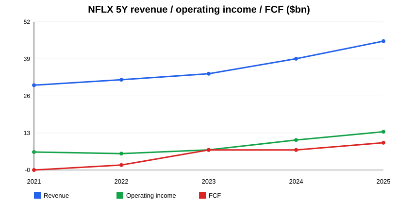
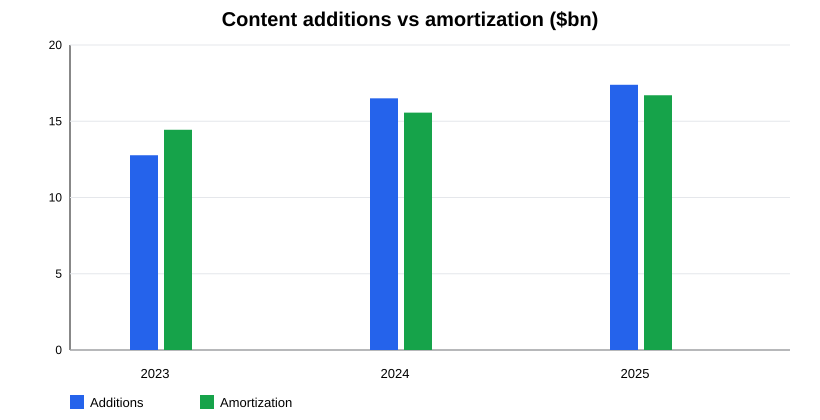
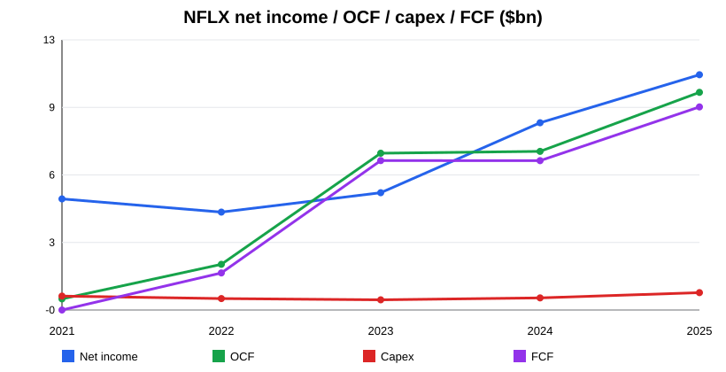
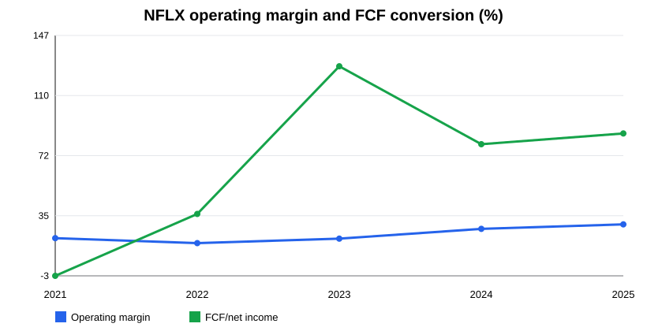

# Netflix, Inc. (NFLX) — Research Deep Dive v1.0

**Tipo de documento:** Research pre-valoración  
**Estado:** v1.0 operativo, no tesis final ni recomendación  
**Fecha de corte:** 13-may-2026  
**Objetivo:** condensar filings, shareholder letters, financials históricos, content accounting y riesgos en una pieza previa al modelo de valoración.

---

## Índice

- [1. Resumen ejecutivo](#1-resumen-ejecutivo)
- [2. Modelo de negocio y motores económicos](#2-modelo-de-negocio-y-motores-económicos)
- [3. Segmentos: lectura operativa](#3-segmentos-lectura-operativa)
- [4. Financial forensics](#4-financial-forensics)
- [5. Guidance, earnings call y outlook](#5-guidance-earnings-call-y-outlook)
- [6. Financials históricos: perspectiva 5 años](#6-financials-históricos-perspectiva-5-años)
- [7. Sector, competencia y posición relativa](#7-sector-competencia-y-posición-relativa)
- [8. Noticias y narrativa reciente](#8-noticias-y-narrativa-reciente)
- [9. Fortalezas, riesgos y variables de modelización](#9-fortalezas-riesgos-y-variables-de-modelización)
- [10. Conclusión pre-valoración](#10-conclusión-pre-valoración)
- [11. Peer / sector framework for valuation](#11-peer--sector-framework-for-valuation)
- [12. Historical financial snapshot para alimentar el modelo](#12-historical-financial-snapshot-para-alimentar-el-modelo)
- [13. Scenario matrix pre-modelo](#13-scenario-matrix-pre-modelo)
- [14. Content cash spend / FCF bridge conceptual](#14-content-cash-spend--fcf-bridge-conceptual)
- [15. Checklist final para pasar a valoración](#15-checklist-final-para-pasar-a-valoración)
- [16. Bibliografía y fuentes](#16-bibliografía-y-fuentes)
- [17. Methodology notes / limitations / next iteration](#17-methodology-notes--limitations--next-iteration)

---

## 1. Resumen ejecutivo

Netflix entra en 2026 como un negocio de mucha más calidad financiera que en el ciclo 2021-2022. La compañía ha pasado de una narrativa centrada en saturación de suscriptores, gasto de contenido y dudas sobre caja libre a un perfil de crecimiento rentable: **$45.2bn de revenue en FY2025**, **$13.3bn de operating income**, **29.5% de operating margin**, **$10.1bn de operating cash flow** y **$9.5bn de FCF simple**.

La mejora no es solo contable. Desde 2023, la conversión de beneficio a caja cambió de régimen: FCF/net income pasó de negativo en 2021 y 36% en 2022 a **128% en 2023**, **80% en 2024** y **86% en 2025**. El driver es una combinación de pricing, paid sharing, recuperación del crecimiento, disciplina de contenido y escalamiento operativo. El capex clásico es irrelevante para Netflix —~1%-2% de revenue—, pero eso no significa que el negocio sea asset-light en sentido económico: la inversión clave está en contenido, que pasa por operating cash flow.

La pregunta central para valoración no es “¿Netflix es líder en streaming?” —sí—, sino: **¿cuánto de la mejora de margen/FCF es estructural y cuánto depende de tailwinds de paid sharing, pricing y timing de contenido?** La valoración debe probar si Netflix puede sostener crecimiento low/mid-teens, margen operativo >30% y FCF alto mientras reinvierte en contenido, publicidad, juegos, deportes/eventos y potencial integración de Warner Bros.

El punto de mayor riesgo analítico es la transacción Warner Bros./WBD referenciada en filings recientes. El FY2025 10-K menciona compromisos de bridge facility de **$42.2bn** vinculados a la operación. Si se cierra, cambia radicalmente el balance, la complejidad regulatoria, el mix de contenido, la amortización, la deuda y la política de buybacks. Por tanto, cualquier valoración debe tener dos capas: **standalone NFLX** y **NFLX post-WBD**.

---

## 2. Modelo de negocio y motores económicos

Netflix monetiza una base global de usuarios mediante suscripciones direct-to-consumer, pricing por plan, tier con publicidad y, de forma todavía secundaria, iniciativas de juegos, eventos en directo, deportes/entretenimiento y licencias/partnerships selectivos. La compañía es una plataforma de entretenimiento con escala global, datos propios de consumo, distribución directa, marca fuerte y una estructura tecnológica común.

Los motores económicos principales son:

- **Revenue por usuario / ARM:** precio, mix de planes, ad tier, geografía y FX.
- **Crecimiento de miembros / hogares monetizados:** net adds, paid sharing, penetración internacional, churn.
- **Engagement:** determina retención, pricing power, inventario publicitario y ROI de contenido.
- **Contenido:** gasto, hit-rate, amortización, reutilización global y vida útil económica.
- **Publicidad:** nuevo revenue pool incremental, con potencial de margen alto cuando escala inventario, targeting y demanda.
- **Operating leverage:** plataforma tecnológica y distribución global permiten que revenue incremental caiga con buen margen si el gasto de contenido y marketing crece por debajo del revenue.

Netflix no reporta ya el negocio como una cartera de segmentos tradicionales comparables. Para el modelo, conviene separar la economía en cuatro capas: **core subscription**, **advertising**, **content investment engine** y **capital allocation/balance sheet**. Esa separación es más útil que intentar forzar segmentos que la compañía no reporta.

---

## 3. Segmentos: lectura operativa

### Core subscription

El core sigue siendo suscripción. En Q4 2025 Netflix cruzó **325M paid memberships** y cerró 2025 con revenue de **$45.2bn**, +16% reported y +17% FX-neutral según la shareholder letter. La calidad del core está en la combinación de escala global, pricing power y menor dependencia de terceros distribuidores.

El paid sharing fue un tailwind claro, pero no debe extrapolarse linealmente. Para valoración, hay que normalizar el crecimiento cuando ese efecto madure. El input clave no es solo miembros, sino **revenue growth por cohortes/geografías** y elasticidad a precio.

### Advertising tier

La publicidad es la principal opción de crecimiento incremental. La shareholder letter indica **ad revenue >$1.5bn en 2025**, creciendo más de 2.5x, y management espera que **aproximadamente se duplique en 2026**. La tesis bull requiere que ads no canibalice ARPU premium de forma material y que el inventario mejore fill rate, pricing y targeting.

Todavía falta información fina sobre margen del negocio publicitario. En fase de inversión, puede requerir ad-tech, ventas, medición y partners. En escala, debería mejorar monetización por usuario en mercados desarrollados y crear un plan de entrada más barato en mercados sensibles al precio.

### Content engine

El contenido es el “capex económico” de Netflix. La compañía capitaliza contenido producido/licenciado y lo amortiza en cost of revenues. En 2025 las **additions to streaming content assets fueron $17.1bn**, mientras la **content amortization fue $16.4bn**. Más del 90% de un activo de contenido se espera amortizar dentro de cuatro años desde disponibilidad.

Esto importa porque FCF ya descuenta pagos de contenido dentro de OCF. La caja libre de Netflix es más limpia que la de una compañía que capitaliza gasto fuera de OCF, pero la comparabilidad con capex clásico exige mirar contenido, obligaciones y amortización.

### Capital allocation

Netflix no paga dividendos; devuelve capital vía buybacks. Entre 2023 y 2025 recompró **$21.4bn** acumulados, usando aproximadamente 87%-97% del FCF anual. Esto es razonable en un negocio standalone con balance cada vez más ligero, pero puede cambiar si la operación Warner Bros./WBD se materializa y exige financiación/deleveraging.

---

## 4. Financial forensics

La mejora financiera de Netflix es visible en tres niveles.

Primero, **margen operativo**: de 17.8% en 2022 a 29.5% en 2025. Esto refleja escala, disciplina de contenido, menor presión competitiva irracional en streaming y monetización de paid sharing/pricing.

Segundo, **conversión a caja**: OCF subió de $2.0bn en 2022 a $10.1bn en 2025. El FCF simple —OCF menos PP&E capex— alcanzó $9.5bn. Dado que el contenido se paga dentro de OCF, esta caja ya incorpora el principal gasto de inversión del negocio.

Tercero, **balance**: net debt cayó de $8.7bn en 2021 a $4.4bn en 2025, con cash + short-term investments de $9.1bn y long-term debt de $13.5bn. Q1 2026 muestra net debt cercano a $1.1bn por aumento de caja, aunque esa lectura debe interpretarse con cuidado por el contexto de financiación de la transacción WBD.

La zona gris es la sostenibilidad. La empresa todavía mantiene obligaciones de contenido relevantes: en FY2025 reportó content liabilities reconocidas de **$5.7bn** y **$18.4bn** de obligaciones no reconocidas en balance por no cumplir criterios de reconocimiento. No es deuda financiera, pero sí compromiso operativo relevante para el modelo.

---

## 5. Guidance, earnings call y outlook

La guía FY2026 de la shareholder letter Q4 2025 apunta a otro año de crecimiento rentable:

| Métrica | Outlook management |
|---|---:|
| FY2026 revenue | $50.7bn-$51.7bn |
| Crecimiento revenue | +12%-14% Y/Y |
| FY2026 operating margin | 31.5% |
| Advertising revenue | aproximadamente x2 |
| Q1 2026 forecast revenue | $12.157bn |
| Q1 2026 forecast op margin | 32.1% |

Q1 2026 superó ligeramente el forecast de revenue y margen: **$12.25bn revenue**, **$3.96bn operating income**, **32.3% operating margin** y **$5.09bn FCF**. El net income de Q1 fue inusualmente alto en la extracción SEC (**$5.28bn**); debe revisarse en el modelo por posibles efectos fiscales/one-offs antes de anualizar.

La narrativa de management se concentra en mejorar el servicio core, expandir categorías de contenido —incluyendo video podcasts y games—, escalar ads y cerrar/integrar Warner Bros. La valoración debe separar crecimiento orgánico de M&A.

---

## 6. Financials históricos: perspectiva 5 años

### P&L / cash flow

| Fiscal year | Revenue | Operating income | Op. margin | Net income | OCF | Capex | FCF | Capex / revenue | FCF / net income |
|---:|---:|---:|---:|---:|---:|---:|---:|---:|---:|
| 2021 | 29.698 | 6.195 | 20.9% | 5.116 | 0.393 | 0.525 | -0.132 | 1.8% | -2.6% |
| 2022 | 31.616 | 5.633 | 17.8% | 4.492 | 2.026 | 0.408 | 1.619 | 1.3% | 36.0% |
| 2023 | 33.723 | 6.954 | 20.6% | 5.408 | 7.274 | 0.349 | 6.926 | 1.0% | 128.1% |
| 2024 | 39.001 | 10.418 | 26.7% | 8.712 | 7.361 | 0.440 | 6.922 | 1.1% | 79.5% |
| 2025 | 45.183 | 13.327 | 29.5% | 10.981 | 10.149 | 0.688 | 9.461 | 1.5% | 86.2% |

### Balance / liquidity

| Fiscal year | Assets | Equity | Cash + STI | Long-term debt | Net debt / (cash) | Debt / equity |
|---:|---:|---:|---:|---:|---:|---:|
| 2021 | 44.585 | 15.849 | 6.028 | 14.693 | 8.665 | 92.7% |
| 2022 | 48.595 | 20.777 | 6.058 | 14.353 | 8.295 | 69.1% |
| 2023 | 48.732 | 20.588 | 7.138 | 14.143 | 7.005 | 68.7% |
| 2024 | 53.630 | 24.744 | 9.584 | 13.798 | 4.214 | 55.8% |
| 2025 | 55.597 | 26.615 | 9.062 | 13.464 | 4.402 | 50.6% |

### Capital allocation

| Fiscal year | Dividends | Share repurchases | FCF | Repurchases / FCF |
|---:|---:|---:|---:|---:|
| 2021 | 0.000 | 0.600 | -0.132 | n/m |
| 2022 | 0.000 | 0.000 | 1.619 | 0.0% |
| 2023 | 0.000 | 6.045 | 6.926 | 87.3% |
| 2024 | 0.000 | 6.264 | 6.922 | 90.5% |
| 2025 | 0.000 | 9.127 | 9.461 | 96.5% |

---

## 7. Sector, competencia y posición relativa

Netflix compite contra varias categorías, no solo contra “streamers”. El peer set económico relevante incluye:

- **Streaming/entertainment:** Disney/Hulu, Warner Bros. Discovery/Max, Paramount, Peacock/NBCU.
- **Big Tech video/attention:** YouTube/Google, Amazon Prime Video, Apple TV+, TikTok/social video.
- **Sports/live/event attention:** ESPN, DAZN, leagues, local broadcasters.
- **Advertising platforms:** YouTube, Meta, Amazon Ads, connected TV networks.

La ventaja de Netflix es que tiene escala global directa, producto simple, cultura de datos/contenido, distribución propia y marca. La desventaja es que compite por tiempo de usuario contra plataformas con ecosistemas más amplios, subsidios cruzados o derechos deportivos/UGC con economics distintos.

La comparación de múltiplos debe evitar errores: Disney/WBD/Paramount incluyen legacy media, parques, cable, deuda y activos no comparables. YouTube sería el peer más peligroso por engagement y ads, pero no cotiza separado. Para valoración, el marco correcto es una mezcla de **subscription compounder + global ad platform emergente + content IP engine**.

---

## 8. Noticias y narrativa reciente

La narrativa model-relevant se resume en cuatro puntos:

1. **Advertising scale-up:** >$1.5bn en 2025 y expectativa de duplicar en 2026. Esto puede añadir crecimiento y margen, pero requiere ejecución comercial.
2. **Paid sharing/pricing:** sigue impulsando revenue, pero debe normalizarse como tailwind que madura.
3. **Content discipline:** additions y amortization están relativamente alineadas en 2025; si el crecimiento exige más gasto, FCF puede comprimirse.
4. **Warner Bros./WBD:** potencial cambio de perímetro, deuda, integración y regulación. Es suficientemente material como para no mezclar standalone y pro forma.

---

## 9. Fortalezas, riesgos y variables de modelización

### Fortalezas

- Liderazgo global en streaming premium.
- Escala directa al consumidor y datos propios.
- Pricing power demostrado.
- FCF fuerte desde 2023.
- Ads como opcionalidad incremental.
- Balance standalone razonable antes de M&A.

### Riesgos

- Normalización de paid sharing y menor crecimiento de miembros.
- Elasticidad negativa a subidas de precio.
- Competencia de YouTube/TikTok/Amazon/Disney y saturación de atención.
- Content hit-rate y coste de producción/licencias.
- Riesgo contable/económico de amortización de contenido.
- FX por exposición internacional.
- Riesgo de integración, deuda y regulación si WBD se cierra.

### Variables de modelización

- Revenue CAGR standalone 2026-2030.
- Operating margin terminal sostenible.
- Content cash spend / revenue.
- Ads revenue y margen incremental.
- Churn/pricing elasticity.
- Buybacks vs deleveraging.
- Coste de deuda y estructura pro forma post-WBD.

---

## 10. Conclusión pre-valoración

Netflix merece un modelo de valoración de alta calidad, pero no uno simplista. La compañía ha demostrado que puede convertir escala global en margen y caja, y FY2025/Q1 2026 muestran un negocio fuerte. El mercado probablemente no debate la supervivencia del streaming, sino la durabilidad del crecimiento rentable y el impacto de M&A.

La valoración debe testear tres preguntas:

1. **¿Puede Netflix sostener crecimiento de revenue low/mid-teens sin depender de paid sharing?**
2. **¿Es 31%-32% de operating margin un nivel sostenible, techo temporal o punto medio hacia mayor expansión?**
3. **¿El FCF standalone pertenece al accionista vía buybacks, o será absorbido por deuda/integración de Warner Bros.?**

---

## 11. Peer / sector framework for valuation

Usar peers con cautela:

| Peer / grupo | Utilidad | Problema |
|---|---|---|
| Disney | Contenido premium, streaming, IP | parques/cable distorsionan múltiplos |
| WBD | library/content y streaming | deuda y legacy TV muy distintos |
| Paramount | contenido y distribución | escala inferior y stress financiero |
| YouTube/Alphabet | atención + ads + video global | no es pure-play |
| Amazon | Prime Video + ads | subsidio por ecommerce/cloud |
| Spotify | suscripción global | audio, margen/royalties distintos |

Métricas útiles: EV/EBIT, EV/FCF, P/E, revenue growth, op margin, FCF margin, net debt/EBITDA. Para Netflix, EV/EBIT y EV/FCF son más útiles que EV/Sales porque el debate ya es rentabilidad/caja, no solo escala.

---

## 12. Historical financial snapshot para alimentar el modelo

Inputs base sugeridos:

- FY2025 revenue: **$45.183bn**.
- FY2026 revenue guide: **$50.7bn-$51.7bn**.
- FY2025 operating margin: **29.5%**.
- FY2026 operating margin guide: **31.5%**.
- FY2025 FCF: **$9.461bn**.
- FY2025 cash + STI: **$9.062bn**.
- FY2025 long-term debt: **$13.464bn**.
- FY2025 buybacks: **$9.127bn**.
- FY2025 content additions: **$17.097bn**.
- FY2025 content amortization: **$16.422bn**.
- FY2025 recognized content liabilities: **$5.664bn**.
- Unrecognized content obligations disclosed: **$18.4bn**.

---

## 13. Scenario matrix pre-modelo

| Variable | Bear | Base | Bull |
|---|---|---|---|
| Revenue growth | high single digit after 2026 | low double digit normalizing | sustained low/mid teens |
| Operating margin | peaks near 31%, drifts down | stabilizes 31%-33% | expands >34% |
| Ads | grows but low margin/cannibalizing | doubles 2026, scales gradually | becomes high-margin growth engine |
| Content spend | rises faster than revenue | grows broadly with revenue | leverage from global reuse/discipline |
| WBD | dilutive/debt/regulatory drag | manageable integration | strategic library + scale upside |
| Capital returns | buybacks curtailed | moderate buybacks post needs | high FCF returns continue |

---

## 14. Content cash spend / FCF bridge conceptual

Para Netflix, el bridge correcto no es capex tradicional. La lógica debe ser:

**Revenue → operating income → net income → OCF after content cash payments → PP&E capex → FCF**

El contenido entra por dos vías:

- **P&L:** amortización de contenido en cost of revenues.
- **Cash flow:** pagos/adiciones de contenido dentro de operating cash flow.

Si additions > amortization de forma persistente, puede haber presión de caja futura aunque el margen contable luzca bien. Si amortization > additions o ambas crecen por debajo del revenue, mejora la conversión a FCF. En 2025, additions de $17.1bn y amortization de $16.4bn están bastante alineadas; eso apoya la calidad del FCF, pero no garantiza que se mantenga si la guerra de contenido se reactiva o WBD altera el perímetro.

---

## 15. Checklist final para pasar a valoración

- [ ] Separar modelo standalone y modelo post-WBD.
- [ ] Confirmar tratamiento del Q1 2026 net income y cualquier one-off.
- [ ] Definir revenue CAGR 2026-2030 por core subscription vs ads.
- [ ] Modelar operating margin 2026 guide 31.5% y terminal.
- [ ] Proyectar content additions/amortization/content liabilities.
- [ ] Incluir FX sensitivity.
- [ ] Definir buyback policy standalone vs deleveraging post-M&A.
- [ ] Construir sensibilidad FCF margin vs content spend/revenue.
- [ ] Comparar EV/FCF y EV/EBIT con peers ajustados.
- [ ] Documentar hipótesis de paid sharing normalization y pricing.

---

## 16. Bibliografía y fuentes

Fuentes primarias:

- SEC Companyfacts, Netflix CIK 1065280: `https://data.sec.gov/api/xbrl/companyfacts/CIK0001065280.json`.
- FY2025 Form 10-K, filed 2026-01-23: `https://www.sec.gov/Archives/edgar/data/1065280/000106528026000034/nflx-20251231.htm`.
- Q1 2026 Form 10-Q, filed 2026-04-17: `https://www.sec.gov/Archives/edgar/data/1065280/000106528026000138/nflx-20260331.htm`.
- Q4 2025 Shareholder Letter / Exhibit 99.1 to 8-K: `https://www.sec.gov/Archives/edgar/data/1065280/000106528026000033/ex991_q425.htm`.
- Q4 2025 8-K cover: `https://www.sec.gov/Archives/edgar/data/1065280/000106528026000033/nflx-20260120.htm`.
- Q1 2026 8-K cover: `https://www.sec.gov/Archives/edgar/data/1065280/000106528026000139/nflx-20260422.htm`.

Métrica derivada:

- FCF = Net cash provided by operating activities − purchases of property and equipment.
- Capex/revenue = PP&E capex / revenue.
- FCF/net income = derived FCF / net income.
- Net debt = long-term debt − cash and short-term investments. No ajuste por lease liabilities en esta v1.0.

---

## 17. Methodology notes / limitations / next iteration

Este informe es un pack pre-valoración, no recomendación de inversión. Las cifras históricas FY2021-FY2025 proceden de SEC Companyfacts y se reconciliaron con el FY2025 10-K cuando aplica. La extracción de content economics cubre 2023-2025 desde FY2025 10-K; 2021-2022 no se extrajeron en esta v1.0.

Limitaciones principales:

- La transacción Warner Bros./WBD puede invalidar una valoración standalone si cambia materialmente el perímetro.
- No se incluye todavía valoración DCF/múltiplos ni precio objetivo.
- No se desagregan revenue/margen por geografía o tier, porque la disclosure pública es limitada.
- Ads revenue y margen incremental requieren más datos o hipótesis explícitas.

Próxima iteración recomendada: construir modelo standalone v0 con escenarios y una segunda hoja pro forma WBD/debt/integration, antes de debatir múltiplos.
