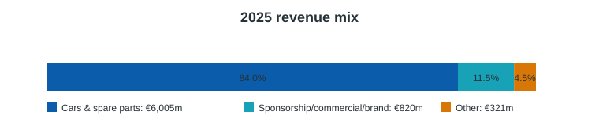
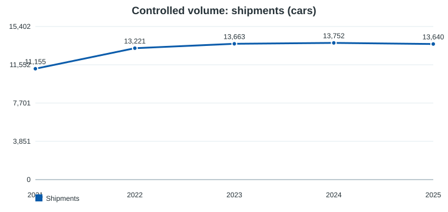
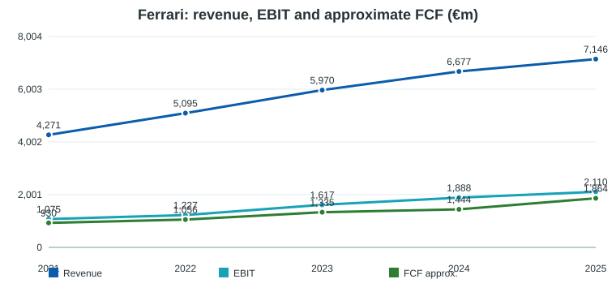
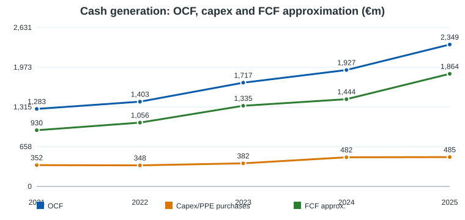

# Ferrari N.V. (RACE) — Deep Dive pre-valoración

**Fecha:** 2026-05-21  
**Ticker:** RACE / NYSE, Euronext Milan  
**Compañía:** Ferrari N.V.  
**Tipo:** Deep Dive equity pre-valoración  
**Conclusión operativa:** no es una recomendación de inversión; es un pack para alimentar análisis y valoración del Portfolio Manager.

## Índice

1. Resumen del negocio  
2. Resumen ejecutivo  
3. Modelo de negocio y motores económicos  
4. Segmentos y lectura operativa  
5. Financial forensics  
6. Guidance, earnings y outlook  
7. Financials históricos 5 años  
8. Sector, competencia y posición relativa  
9. Noticias y narrativa reciente  
10. Fortalezas, riesgos y variables de modelización  
11. Conclusión pre-valoración  
12. Framework de valoración, escenarios y checklist  
13. Bibliografía y metodología

---

## 1. Resumen del negocio

Ferrari es un fabricante de coches deportivos y de lujo de ultra-alta gama. La tesis económica no se parece a la de un OEM tradicional: el activo principal es una combinación de marca, escasez controlada, comunidad de clientes, producto aspiracional, competición y poder de pricing. La compañía vende coches nuevos y repuestos, monetiza personalización y series especiales, obtiene ingresos de patrocinio/commercial/brand vinculados a Formula 1, WEC y lifestyle, y mantiene una actividad de servicios financieros principalmente en EE.UU.

En 2025 vendió **13.640 coches**, prácticamente plano frente a 2024, pero elevó ingresos a **€7.146m**, EBIT a **€2.110m** y margen EBIT a **29,5%**. La lectura clave es que Ferrari sigue creciendo más por **mix, precio, personalización, series especiales y monetización de marca** que por expansión agresiva de unidades. Esa es precisamente la variable que hay que proteger en valoración: crecer sin diluir escasez.

---

## 2. Resumen ejecutivo

**Calidad del negocio.** Ferrari combina rasgos de ultra-luxury y autos: volúmenes deliberadamente limitados, backlog/order book profundo, capacidad de subir precio y personalización, márgenes estructuralmente superiores al automóvil tradicional y ROIC implícito alto. La marca reduce elasticidad de demanda, pero no elimina ciclo: UHNW confidence, China, FX, tariffs, producto y ejecución tecnológica importan.

**Pregunta central de inversión.** La valoración debe testar si Ferrari puede sostener un algoritmo de crecimiento de revenue mid/high single digit, margen EBIT alrededor de 29-30% o superior, y FCF industrial >€1,5bn sin sacrificar exclusividad ni asumir un capex/R&D burden excesivo por electrificación.

**Lo que importa para valorar:**
- volumen compatible con escasez;
- ASP/mix/personalización;
- contribución de Icona/Supercar/Special Series;
- margen EBIT/EBITDA sostenible tras EV/hybrid transition;
- capex y capitalized development costs;
- industrial FCF conversion;
- China y US tariffs;
- disciplina de buybacks a múltiplos exigentes.

**Perfil financiero inicial.** Ferrari cerró 2025 con cash de **€1,467m**, debt total de **€2,884m**, pero solo **€32m de Net Industrial Debt**. En Q1 2026 pasó a **€388m de Net Industrial Cash**. Para análisis de equity conviene separar deuda de servicios financieros de la caja/deuda industrial.

---

## 3. Modelo de negocio y motores económicos

Ferrari gana dinero con una fórmula muy específica:

- **Escasez gestionada:** el volumen se asigna por región y producto para preservar exclusividad. Esto sostiene listas de espera, pricing y residual values.
- **Mix de producto:** Range, Special Series, Icona y Supercar tienen economics distintos. Icona/Supercar como Daytona SP3/F80 pueden aportar precio y margen extraordinarios en años de entrega.
- **Personalización:** opciones interiores/exteriores generan ingresos incrementales y margen accretive. Es uno de los drivers más limpios porque monetiza disposición a pagar sin aumentar volumen.
- **Racing y marca:** Formula 1, WEC, patrocinios, licensing y lifestyle expanden relevancia cultural. No son solo marketing: generan ingresos directos y refuerzan brand equity.
- **Servicios financieros:** apoyan venta y customer relationship, pero deben analizarse separados porque introducen receivables/debt y distorsionan leverage consolidado.

La compañía insiste en una cartera tecnológicamente neutral: combustión interna, híbrido y eléctrico. El punto crítico es que el primer full electric, Ferrari Luce, y los nuevos híbridos deben preservar emoción, precio y margen.

---

## 4. Segmentos y lectura operativa

Ferrari no reporta segmentos operativos al estilo industrial clásico; usa categorías de ingresos. El mix 2025 fue:

| €m | 2025 | % ventas | 2024 | % ventas | 2023 | % ventas |
|---|---:|---:|---:|---:|---:|---:|
| Cars and spare parts | 6.005 | 84,0% | 5.728 | 85,8% | 5.119 | 85,7% |
| Sponsorship, commercial and brand | 820 | 11,5% | 670 | 10,0% | 572 | 9,6% |
| Other | 321 | 4,5% | 279 | 4,2% | 279 | 4,7% |
| **Net revenues** | **7.146** | 100% | **6.677** | 100% | **5.970** | 100% |

**Lectura:** cars/spare parts sigue siendo el core, pero sponsorship/commercial/brand está creciendo más rápido. Esto es positivo si amplía monetización de marca sin trivializarla. Riesgo: lifestyle/licensing mal gestionado puede diluir percepción de ultra-lujo.

**Geografía 2025 por unidades:** EMEA 46,5%, Americas 28,9%, China/HK/Taiwan 6,9%, Rest of APAC 17,7%. La caída de China desde niveles anteriores es una variable a monitorizar, aunque Ferrari tiene capacidad de reasignar supply.

---

## 5. Financial forensics

### 5.1 Revenue, EBIT y FCF

El crecimiento 2021-2025 es de alta calidad: revenue +67%, EBIT +96%, OCF +83%. La expansión de margen EBIT desde ~25,2% en 2021 a 29,5% en 2025 sugiere que pricing/mix han superado inflación, capex de producto y D&A.

### 5.2 Cash bridge

OCF 2025 fue **€2.349m**. Capex/PPE purchases en la tabla XBRL son **€485m**, pero Ferrari define industrial FCF tras inversiones en PPE e intangibles; por eso la métrica de management relevante es **Free Cash Flow from Industrial Activities: €1.535m** en 2025. La diferencia importa: no usar una definición de FCF simplificada sin reconciliarla con capitalized development costs.

### 5.3 Capex, R&D y electrificación

Capex total 2025 fue **€1.013m**: €458m intangibles y €555m PPE. Ferrari capitalizó **€421m** de development costs, 41,5% del R&D total incurrido. La transición hybrid/EV y el e-Building elevan intensidad de inversión; la pregunta no es si capex sube, sino si el cliente Ferrari paga ese capex vía precio/mix sin erosionar margen.

### 5.4 Balance sheet y liquidez

| €m | 2025 | 2024 |
|---|---:|---:|
| Cash & equivalents | 1.467 | 1.742 |
| Total debt | 2.884 | 3.352 |
| Net debt | 1.417 | 1.610 |
| Net Industrial Debt | 32 | 180 |
| Available liquidity | 2.017 | 2.292 |

El leverage industrial es bajo. La deuda consolidada incluye securitizations/financial services y no debe leerse como deuda industrial pura. En Q1 2026, Ferrari reportó **Net Industrial Cash de €388m**.

### 5.5 Capital allocation

Ferrari devuelve capital de forma agresiva: dividendos pagados a owners de **€530m** en 2025 y buybacks de **€785m**. En 2026 aprobó dividendo de aprox. **€640m** y anunció un nuevo buyback multianual de aprox. **€3,5bn hasta 2030**. Esto puede ser accretive si el negocio mantiene crecimiento y ROIC, pero a múltiplos altos el buyback debe evaluarse críticamente.

---

## 6. Guidance, earnings y outlook

Q1 2026 confirmó resiliencia:

| Métrica Q1 2026 | Resultado |
|---|---:|
| Net revenues | €1.848m, +3% YoY / +6% constant currency |
| EBIT | €548m |
| EBIT margin | 29,7% |
| Net profit | €413m |
| EBITDA | €722m |
| EBITDA margin | 39,1% |
| Industrial FCF | €653m |
| Shipments | 3.436, -157 YoY |
| Net Industrial Cash | €388m |

Management confirmó guía 2026:

| Métrica | Guidance 2026 |
|---|---:|
| Net revenues | ~€7,50bn |
| Adjusted EBITDA | ≥€2,93bn |
| Adj. EBITDA margin | ≥39,0% |
| Adjusted EBIT | ≥€2,22bn |
| Adj. EBIT margin | ≥29,5% |
| Adj. diluted EPS | ≥€9,45 |
| Industrial FCF | ≥€1,50bn |

**Lectura:** el guidance implica crecimiento moderado, margen defendido y FCF industrial estable pese a model change-over, D&A, brand/racing/digital spend, FX y tariffs. El order book hacia final de 2027 reduce visibilidad de downside inmediato, pero no elimina riesgo de mix y ciclo lujo.

---

## 7. Financials históricos: perspectiva 5 años

| €m | 2021 | 2022 | 2023 | 2024 | 2025 |
|---|---:|---:|---:|---:|---:|
| Revenue | 4.271 | 5.095 | 5.970 | 6.677 | 7.146 |
| Operating profit / EBIT | 1.075 | 1.227 | 1.617 | 1.888 | 2.110 |
| Net profit | 833 | 939 | 1.257 | 1.526 | 1.600 |
| Operating cash flow | 1.283 | 1.403 | 1.717 | 1.927 | 2.349 |
| PPE capex / purchases | 352 | 348 | 382 | 482 | 485 |
| Approx. FCF before dividends/buybacks | 930 | 1.056 | 1.335 | 1.444 | 1.864 |
| Car shipments | 11.155 | 13.221 | 13.663 | 13.752 | 13.640 |
| Operating margin | 25,2% | 24,1% | 27,1% | 28,3% | 29,5% |
| FCF / net profit approx. | 111,6% | 112,5% | 106,2% | 94,6% | 116,5% |

| €m | 2021 | 2022 | 2023 | 2024 | 2025 |
|---|---:|---:|---:|---:|---:|
| Assets | 6.864 | 7.766 | 8.051 | 9.497 | 9.628 |
| Equity | 2.211 | 2.602 | 3.071 | 3.543 | 3.915 |
| Cash & equivalents | 1.344 | 1.389 | 1.122 | 1.742 | 1.468 |
| Borrowings/debt | 2.630 | 2.812 | 2.477 | 3.352 | 2.884 |
| Dividends paid | 160 | 250 | 329 | 440 | 530 |
| Treasury shares purchased | 231 | 397 | 461 | 581 | 785 |

**Régimen 2021-2025:** Ferrari pasó de recuperación post-COVID a compounder de lujo con margen en expansión. La compañía ha probado poder de precio/mix, pero 2025-2026 será una prueba de normalización: F80, nuevos modelos, primera EV, tariffs y China.

---

## 8. Sector, competencia y posición relativa

El peer set debe dividirse por función analítica:

- **Ultra-luxury/scarcity auto:** Lamborghini, Porsche high-end, Aston Martin, McLaren. Útiles para producto, ciclo, electrificación y capacidad industrial, pero ninguno replica completamente margen/brand scarcity de Ferrari.
- **Luxury goods:** Hermès y LVMH son comparables conceptuales para pricing power, escasez, brand heat y customer base, no para capital intensity ni accounting.
- **High-performance EV/hybrid:** Porsche, Mercedes-AMG, Rimac/Bugatti y nuevos high-end EV entrants. Útiles para testar si EV commoditiza o amplía mercado.

Ferrari merece prima frente a OEMs por escasez y margen, pero no debe valorarse ciegamente como luxury pure-play: tiene fábricas, capex, homologación, ciclo producto, motorsport y riesgo tecnológico.

---

## 9. Noticias y narrativa reciente

- 2025 Capital Markets Day fijó marco estratégico y buyback multianual hasta 2030.
- Q1 2026 confirmó guidance pese a menor shipment YoY y tariffs en EE.UU.
- F80 ramp y Special Series aportan mix positivo.
- Ferrari Luce marca la entrada full electric; deliveries futuras serán test de aceptación del cliente.
- Order book se extiende hacia final de 2027, reforzando visibilidad.
- China/HK/Taiwan sigue siendo un foco de riesgo por menor peso relativo y sensibilidad lujo.

---

## 10. Fortalezas, riesgos y variables de modelización

**Fortalezas**
- Marca global excepcional y base de clientes UHNW.
- Escasez gestionada y pricing power.
- Mix/personalización con margen accretive.
- Order book largo.
- Balance industrial conservador.
- Capital allocation claro.

**Riesgos**
- Dilución de marca por volumen/lifestyle/licensing.
- Error de producto en EV/hybrid transition.
- China/luxury slowdown.
- FX y US tariffs.
- Capex/R&D más alto de lo previsto.
- Dependencia de series especiales para sostener mix.
- Buybacks caros si el múltiplo descuenta perfección.

**Variables de modelo**
- Shipments: crecimiento bajo, no masivo.
- ASP/mix: principal driver de revenue.
- Personalization penetration.
- EBIT margin normalizado: 28,5-30,5% como rango inicial a testar.
- Industrial FCF: ≥€1,5bn como ancla 2026.
- Capex + capitalized development costs.
- Tax rate y FX.
- Share count post-buybacks.

---

## 11. Conclusión pre-valoración

Ferrari parece un compounder de calidad excepcional, pero la valoración debe evitar dos errores: tratarla como OEM cíclico normal o como luxury pure-play sin capital intensity. El núcleo de la tesis es si puede seguir monetizando escasez y tecnología sin romper el contrato psicológico con el cliente: exclusividad, emoción, performance y pertenencia.

El Deep Dive deja tres tests para la valoración:

1. **Scarcity test:** ¿cuánto pueden crecer unidades sin erosionar pricing?  
2. **EV economics test:** ¿Ferrari Luce y la cartera hybrid/EV sostienen margen y ASP?  
3. **FCF durability test:** ¿industrial FCF >€1,5bn es piso sostenible o pico asistido por mix/order book?

---

## 12. Framework de valoración, escenarios y checklist

### Peer / sector framework

Usar múltiplos de luxury y auto como límites, no como respuestas. Para Ferrari, EV/EBIT, P/E y FCF yield son más útiles que EV/Sales. El modelo debe incluir buybacks explícitos.

### Scenario matrix pre-modelo

| Variable | Bear | Base | Bull |
|---|---|---|---|
| Shipments | Plano/ligero descenso | Crecimiento bajo controlado | Crecimiento moderado sin dilución |
| ASP/mix | Normalización post-F80 | Mix positivo gradual | Personalización y Special Series sostienen upside |
| EBIT margin | 27-28% | 29-30% | >30% sostenible |
| Industrial FCF | <€1,3bn | €1,5-1,7bn | >€1,8bn |
| EV transition | Margen dilutivo | Neutral con pricing | Accretive por exclusividad tecnológica |
| China/tariffs | Headwind material | Gestionable | Reasignación de supply compensa |

### Checklist final para pasar a valoración

- [ ] Definir shipment CAGR 2026-2030 compatible con escasez.
- [ ] Modelar ASP/mix separado de volumen.
- [ ] Separar industrial net cash/debt de financial services.
- [ ] Normalizar capex incluyendo intangibles/development costs.
- [ ] Incluir buyback y dividendos explícitos.
- [ ] Sensibilizar margen EBIT 27-31%.
- [ ] Sensibilizar terminal multiple / FCF yield frente a luxury peers.
- [ ] Añadir descuento si EV execution reduce pricing power.

---

## 13. Bibliografía y metodología

**Fuentes primarias**
- Ferrari N.V., **2025 Annual Report and Form 20-F**, filed 19-Feb-2026, SEC accession 0001648416-26-000024.  
  https://www.sec.gov/Archives/edgar/data/1648416/000164841626000024/race-20251231.htm
- Ferrari N.V., **FY 2025 results press release**, filed 10-Feb-2026.  
  https://www.sec.gov/Archives/edgar/data/1648416/000164841626000018/fnvfy2025results.htm
- Ferrari N.V., **Q1 2026 results / Interim Report**, filed 5-May-2026.  
  https://www.sec.gov/Archives/edgar/data/1648416/000162828026030266/ferrarinvinterimreport-033.htm
- Ferrari N.V., **Q1 2026 results press release**, filed 5-May-2026.  
  https://www.sec.gov/Archives/edgar/data/1648416/000164841626000062/fnvq12026results.htm
- SEC companyfacts API, CIK 1648416.  
  https://data.sec.gov/api/xbrl/companyfacts/CIK0001648416.json

**Metodología**
- Cifras en euros y bajo IFRS salvo indicación contraria.
- 5 años históricos usados como estándar metodológico recurrente.
- FCF simplificado en tabla histórica = OCF - PPE capex/purchases; para Ferrari, la métrica de gestión más importante es Industrial FCF, que incorpora inversiones industriales e intangibles y separa financial services.
- No se incluye valoración explícita ni recomendación de compra/venta.

**Limitaciones**
- Segmentos son categorías de revenue, no reporting segments con EBIT por segmento.
- Revenue geográfico exacto requiere tabla dimensional/original; este informe usa shipment mix y comentarios de management.
- La comparabilidad con luxury peers y OEMs es parcial.
