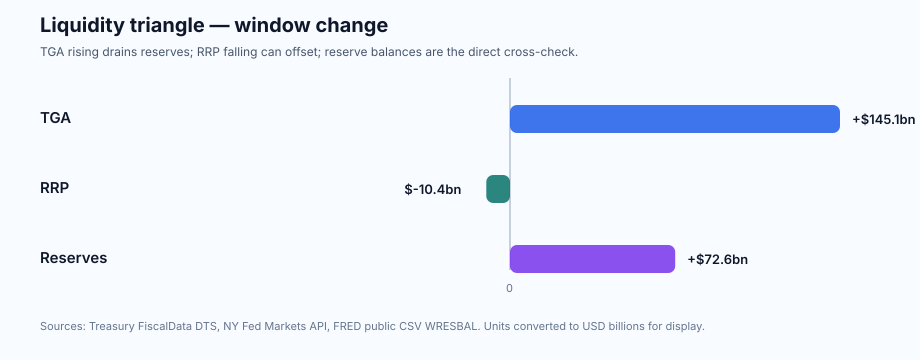

# Macro Monitor v0 — 2026-06-03

Status: draft
Scope: US macro monitor
Owner: Charlie / Financial Research System

## 1. Executive macro summary

- Current macro regime: **growth still expanding, labor resilient, inflation still above target context, rates falling with a positive but flattening curve, and liquidity mixed.**
- Main change since last monitor: **v0.4 now has the full first-pass macro spine connected: rates/curve, inflation, labor, growth/activity and liquidity.**
- Highest-signal release/event ahead: **us_fomc_decision on 2026-06-17 14:00 ET**.
- Key uncertainty: **whether sticky core inflation (3.29% core PCE YoY) and resilient labor keep rates restrictive, or falling rates/positive growth become the dominant portfolio context.**

Bottom line: **macro context is now usable, but still monitor-first.** No automatic portfolio action follows from this report alone; use it to frame valuation sensitivity, sector exposure and follow-up research tasks.

Quick cross-checks: 10Y-2Y spread **0.41%**; core PCE YoY **3.29%**; payroll change **115k**; real GDP QoQ **+0.40%**; TGA/RRP/reserve liquidity remains mixed.

Caveat: this v0 monitor uses official/public source tracking and explicit caveats where the data spine is not yet release-grade.

## 2. Upcoming releases

Window: 2026-06-03 to 2026-08-02

- **2026-06-17 14:00 ET** — FOMC Rate Decision / Statement / SEP (June 2026 FOMC); status: `confirmed_official_calendar`; source: <https://www.federalreserve.gov/monetarypolicy/fomccalendars.htm>
- **2026-06-25 08:30 ET** — Gross Domestic Product (Q1 2026 third estimate); status: `confirmed_official_calendar`; source: <https://www.bea.gov/news/schedule>
- **2026-06-25 08:30 ET** — Personal Income and Outlays / PCE Prices (May 2026); status: `confirmed_official_calendar`; source: <https://www.bea.gov/news/schedule>
- **2026-07-30 08:30 ET** — Gross Domestic Product (Q2 2026 advance estimate); status: `confirmed_official_calendar`; source: <https://www.bea.gov/news/schedule>
- **2026-07-30 08:30 ET** — Personal Income and Outlays / PCE Prices (June 2026); status: `confirmed_official_calendar`; source: <https://www.bea.gov/news/schedule>

Pending manual confirmation:
- Consumer Price Index — BLS schedule page must be checked manually or through an approved access method; automated fetch returned 403.
- Employment Situation / Nonfarm Payrolls — BLS schedule page must be checked manually or through an approved access method; automated fetch returned 403.

## 3. Rates & curve

Data status: `FRED public CSV reachable; rates/curve extraction v0 active`

- Curve shape 10Y-2Y: **positive/upward sloping**; spread: **0.41%**.
- 2Y trend: `falling`; 10Y trend: `falling`; 10Y-2Y curve trend: `falling`.
- Latest rates/spreads:
  - FEDFUNDS — Effective Federal Funds Rate: **3.63%** on 2026-05-01; one-period change: **-0.01pp**; 5-obs trend: **-0.01pp**.
  - DGS2 — Market Yield on U.S. Treasury Securities at 2-Year Constant Maturity: **4.05%** on 2026-06-01; one-period change: **+0.07pp**; 10-obs trend: **-0.02pp**.
  - DGS10 — Market Yield on U.S. Treasury Securities at 10-Year Constant Maturity: **4.47%** on 2026-06-01; one-period change: **+0.02pp**; 10-obs trend: **-0.14pp**.
  - DGS30 — Market Yield on U.S. Treasury Securities at 30-Year Constant Maturity: **4.99%** on 2026-06-01; one-period change: **0.00pp**; 10-obs trend: **-0.15pp**.
  - T10Y2Y — 10-Year Treasury Constant Maturity Minus 2-Year Treasury Constant Maturity: **0.41%** on 2026-06-02; one-period change: **-0.01pp**; 10-obs trend: **-0.13pp**.
  - T10Y3M — 10-Year Treasury Constant Maturity Minus 3-Month Treasury Constant Maturity: **0.69%** on 2026-06-02; one-period change: **0.00pp**; 10-obs trend: **-0.31pp**.
- Source URLs:
  - FEDFUNDS: <https://fred.stlouisfed.org/graph/fredgraph.csv?id=FEDFUNDS&cosd=2026-01-01>
  - DGS2: <https://fred.stlouisfed.org/graph/fredgraph.csv?id=DGS2&cosd=2026-01-01>
  - DGS10: <https://fred.stlouisfed.org/graph/fredgraph.csv?id=DGS10&cosd=2026-01-01>
  - DGS30: <https://fred.stlouisfed.org/graph/fredgraph.csv?id=DGS30&cosd=2026-01-01>
  - T10Y2Y: <https://fred.stlouisfed.org/graph/fredgraph.csv?id=T10Y2Y&cosd=2026-01-01>
  - T10Y3M: <https://fred.stlouisfed.org/graph/fredgraph.csv?id=T10Y3M&cosd=2026-01-01>
- Caveat: rates/curve context frames valuation sensitivity and policy expectations; it is not a standalone portfolio instruction.

Interpretation:

- Curve signal: **positive but flattening curve; monitor whether long-end resilience or front-end repricing is driving the move.**
- Policy expectations signal: **rates are falling across front and long end; confirm whether this reflects easing expectations or growth risk.**
- Portfolio use: frame valuation sensitivity, especially rate-sensitive growth, financials and cyclicals; do not create company tasks from curve data alone.
- Caveat: inflation/labor data are still missing, so the rates read is context rather than a regime conclusion.

## 4. Inflation

Data status: `FRED public CSV reachable; inflation extraction v0 active`

Latest inflation indexes:
- CPIAUCSL — Consumer Price Index for All Urban Consumers: All Items: **332.407** on 2026-04-01; MoM: **+0.64%**; YoY: **3.95%**.
- CPILFESL — Consumer Price Index for All Urban Consumers: All Items Less Food and Energy: **335.423** on 2026-04-01; MoM: **+0.38%**; YoY: **2.99%**.
- PCEPI — Personal Consumption Expenditures: Chain-type Price Index: **130.902** on 2026-04-01; MoM: **+0.40%**; YoY: **3.77%**.
- PCEPILFE — Personal Consumption Expenditures Excluding Food and Energy: **129.630** on 2026-04-01; MoM: **+0.24%**; YoY: **3.29%**.
- Source URLs:
  - CPIAUCSL: <https://fred.stlouisfed.org/graph/fredgraph.csv?id=CPIAUCSL&cosd=2024-01-01>
  - CPILFESL: <https://fred.stlouisfed.org/graph/fredgraph.csv?id=CPILFESL&cosd=2024-01-01>
  - PCEPI: <https://fred.stlouisfed.org/graph/fredgraph.csv?id=PCEPI&cosd=2024-01-01>
  - PCEPILFE: <https://fred.stlouisfed.org/graph/fredgraph.csv?id=PCEPILFE&cosd=2024-01-01>
- Caveat: FRED values are revised series; no consensus/surprise or release-vintage claims are made.

Interpretation:

- Inflation momentum: **core PCE remains above a 2% inflation objective context; keep Fed sensitivity high.**
- Core comparison: core CPI YoY **2.99%**; core PCE YoY **3.29%**.
- Fed relevance: use alongside rates/curve and upcoming FOMC/PCE releases; do not infer policy path without labor and release context.

## 5. Labor market

Data status: `FRED public CSV reachable; labor extraction v0 active`

Latest labor indicators:
- PAYEMS — All Employees, Total Nonfarm: **158,736** thousands on 2026-04-01; one-period change: **115**; window direction: `rising`.
- UNRATE — Unemployment Rate: **4.30** percent on 2026-04-01; one-period change: **0.00**; window direction: `rising`.
- CIVPART — Labor Force Participation Rate: **61.80** percent on 2026-04-01; one-period change: **-0.10**; window direction: `falling`.
- CES0500000003 — Average Hourly Earnings of All Employees, Total Private: **37.41** USD/hour on 2026-04-01; MoM: **+0.16%**; YoY: **3.57%**.
- ICSA — Initial Claims: **215,000** persons on 2026-05-23; one-period change: **5,000**; window direction: `rising`.
- JTSJOL — Job Openings: Total Nonfarm: **7,618** thousands on 2026-04-01; one-period change: **731**; window direction: `rising`.
- Source URLs:
  - PAYEMS: <https://fred.stlouisfed.org/graph/fredgraph.csv?id=PAYEMS&cosd=2024-01-01>
  - UNRATE: <https://fred.stlouisfed.org/graph/fredgraph.csv?id=UNRATE&cosd=2024-01-01>
  - CIVPART: <https://fred.stlouisfed.org/graph/fredgraph.csv?id=CIVPART&cosd=2024-01-01>
  - CES0500000003: <https://fred.stlouisfed.org/graph/fredgraph.csv?id=CES0500000003&cosd=2024-01-01>
  - ICSA: <https://fred.stlouisfed.org/graph/fredgraph.csv?id=ICSA&cosd=2024-01-01>
  - JTSJOL: <https://fred.stlouisfed.org/graph/fredgraph.csv?id=JTSJOL&cosd=2024-01-01>
- Caveat: labor data may be revised; release-time surprise and detail tables are outside v0.

Interpretation:

- Labor demand: **labor market still looks resilient on headline payrolls/unemployment.**
- Headline checks: payroll one-month change **115k**; unemployment **4.30%**; initial claims **215,000**.
- Fed relevance: labor is now usable as context, but not yet release-grade without NFP detail/revisions and BLS calendar wiring.

## 6. Growth / activity

Data status: `FRED public CSV reachable; growth/activity extraction v0 active`

Latest growth/activity indicators:
- GDPC1 — Real Gross Domestic Product: **24,153** bn chained 2017 USD on 2026-01-01; one-period: **+0.40%**; YoY: **2.57%**; window direction: `rising`.
- PCECC96 — Real Personal Consumption Expenditures: **16,723** bn chained 2017 USD on 2026-01-01; one-period: **+0.35%**; YoY: **2.31%**; window direction: `rising`.
- RSXFS — Advance Retail Sales: **656,115** USD millions on 2026-04-01; one-period: **+0.47%**; YoY: **5.21%**; window direction: `rising`.
- RRSFS — Advance Real Retail and Food Services Sales: **227,758** USD millions on 2026-04-01; one-period: **-0.15%**; YoY: **0.69%**; window direction: `rising`.
- INDPRO — Industrial Production: Total Index: **102.496** index on 2026-04-01; one-period: **+0.68%**; YoY: **1.35%**; window direction: `rising`.
- HOUST — Housing Starts: **1,465** thousands SAAR on 2026-04-01; one-period: **-2.79%**; YoY: **4.64%**; window direction: `rising`.
- PERMIT — New Privately-Owned Housing Units Authorized by Building Permits: **1,423** thousands SAAR on 2026-04-01; one-period: **+4.40%**; YoY: **-1.52%**; window direction: `falling`.
- DGORDER — Manufacturers' New Orders: Durable Goods: **346,182** USD millions on 2026-04-01; one-period: **+8.02%**; YoY: **17.26%**; window direction: `rising`.
- NEWORDER — Manufacturers' New Orders: Nondefense Capital Goods Excluding Aircraft: **82,487** USD millions on 2026-04-01; one-period: **-0.97%**; YoY: **10.53%**; window direction: `rising`.
- Source URLs:
  - GDPC1: <https://fred.stlouisfed.org/graph/fredgraph.csv?id=GDPC1&cosd=2024-01-01>
  - PCECC96: <https://fred.stlouisfed.org/graph/fredgraph.csv?id=PCECC96&cosd=2024-01-01>
  - RSXFS: <https://fred.stlouisfed.org/graph/fredgraph.csv?id=RSXFS&cosd=2024-01-01>
  - RRSFS: <https://fred.stlouisfed.org/graph/fredgraph.csv?id=RRSFS&cosd=2024-01-01>
  - INDPRO: <https://fred.stlouisfed.org/graph/fredgraph.csv?id=INDPRO&cosd=2024-01-01>
  - HOUST: <https://fred.stlouisfed.org/graph/fredgraph.csv?id=HOUST&cosd=2024-01-01>
  - PERMIT: <https://fred.stlouisfed.org/graph/fredgraph.csv?id=PERMIT&cosd=2024-01-01>
  - DGORDER: <https://fred.stlouisfed.org/graph/fredgraph.csv?id=DGORDER&cosd=2024-01-01>
  - NEWORDER: <https://fred.stlouisfed.org/graph/fredgraph.csv?id=NEWORDER&cosd=2024-01-01>
- Caveat: FRED values are revised series; no consensus/surprise or release-vintage claims are made.

Interpretation:

- Growth momentum: **real GDP and real PCE are still expanding in the latest quarterly observations.**
- Consumer/capex split: **real retail sales fell in the latest monthly observation; consumer momentum needs monitoring.** industrial production MoM **+0.68%**; core capex orders MoM **-0.97%**.
- Cyclical risk: context is not recessionary from this minimal block alone, but full call requires revisions, ISM/surveys and credit conditions.

## 7. Liquidity / Treasury

Data status: `Treasury FiscalData, NY Fed Markets and FRED public CSV reachable; TGA/RRP/reserve balances extraction v0 active`

- Source: Treasury FiscalData Daily Treasury Statement; record date: **2026-06-01**; units: `USD millions`.
- TGA opening balance: **$903,881mn**.
- Total TGA deposits: **$280,267mn**.
- Total TGA withdrawals: **$327,307mn**.
- TGA one-day change: **+$54,171mn** vs prior available DTS record.
- TGA 10-record trend (2026-05-18 → 2026-06-01): **+$145,062mn**; direction: `rising`.
- Recent TGA history, latest first:
  - 2026-06-01: $903,881mn
  - 2026-05-29: $849,710mn
  - 2026-05-28: $842,660mn
  - 2026-05-27: $881,329mn
  - 2026-05-26: $825,550mn
- Source URL: <https://api.fiscaldata.treasury.gov/services/api/fiscal_service/v1/accounting/dts/operating_cash_balance>
- Caveat: Treasury accounting fields need exact source definitions; treat this as liquidity context, not a standalone signal.

NY Fed reverse repo:
- Source: NY Fed Markets API; latest operation date: **2026-06-02**; units: `USD billions`.
- Total accepted RRP amount: **$2.502bn**.
- Accepted counterparties: **32.0**; award/offering rate: **3.5%**.
- RRP one-day change: **+$1.200bn** vs prior available operation.
- RRP 10-operation trend (2026-05-19 → 2026-06-02): **-$10.409bn**; direction: `falling`.
- Recent RRP history, latest first:
  - 2026-06-02: $2.502bn
  - 2026-06-01: $1.302bn
  - 2026-05-29: $11.677bn
  - 2026-05-28: $1.163bn
  - 2026-05-27: $1.853bn
- Source URL: <https://markets.newyorkfed.org/api/rp/reverserepo/all/results/last/10.csv>
- Caveat: reverse repo take-up is useful liquidity context, not a standalone macro/portfolio signal.

Fed reserve balances:
- Source: FRED public CSV `WRESBAL` / Reserve Balances with Federal Reserve Banks; latest observation: **2026-05-27**; units: `USD millions`.
- Reserve balances: **$3,066,560mn**.
- Reserve balances one-period change: **-$63,002mn** vs prior available observation.
- Reserve balances 10-observation trend (2026-03-25 → 2026-05-27): **+$72,605mn**; direction: `rising`.
- Recent reserve balances history, latest first:
  - 2026-05-27: $3,066,560mn
  - 2026-05-20: $3,129,562mn
  - 2026-05-13: $3,102,810mn
  - 2026-05-06: $3,032,588mn
  - 2026-04-29: $2,918,599mn
- Source URL: <https://fred.stlouisfed.org/graph/fredgraph.csv?id=WRESBAL&cosd=2026-01-01>
- Caveat: reserve balances improve the liquidity read, but still need funding-market context before portfolio conclusions.

To track next:

- Treasury General Account / operating cash balance trend
- Deposits / withdrawals where useful
- Bank reserves / reserve balances trend
- Funding spreads / market plumbing stress indicators as next v0.2 extension

Interpretation:

- Automatic liquidity read: **mixed liquidity context: rising TGA is a reserve drain, while falling RRP can partly offset by releasing cash from the facility.**
- Inputs: TGA trend `rising` (+$145,062mn over window); RRP trend `falling` (-$10.409bn over window).
- Cross-check: reserve balances trend `rising` (+$72,605mn over window). This is the direct balance-sheet confirmation leg for the TGA/RRP read.
- Portfolio use: monitor net effect; do not collapse it into a single bullish/bearish signal.
- Caveat: this is a rules-based context note, not an investment conclusion; funding spreads and market plumbing stress indicators are still outside the v0 data spine.

## 8. Portfolio context

Operating rule: macro informs portfolio context; it does not make portfolio decisions.

- Portfolio areas potentially affected: rate-sensitive growth, financials/banks, cyclicals, housing-exposed names, consumer discretionary, USD/liquidity-sensitive assets and valuation duration broadly.
- Current macro framing: falling rates and positive growth are supportive context, but sticky core inflation and mixed liquidity prevent a clean risk-on conclusion.
- Key numbers to carry into portfolio review: 10Y **4.47%**; 10Y-2Y **0.41%**; core PCE YoY **3.29%**; unemployment **4.30%**; real GDP QoQ **+0.40%**.
- Actionability: **monitor only**. No model update or company-specific task should be created from this report alone unless the user wants a sector/company sensitivity pass.

## 9. Open questions

- `<question 1>`
- `<question 2>`
- `<question 3>`

## 10. Source discipline

- Official source URLs must be cited for every factual release claim.
- Consensus/surprise must be omitted unless explicitly sourced.
- Revisions must be stated explicitly where relevant.
- Any missing data should remain marked as pending/not found rather than inferred.
